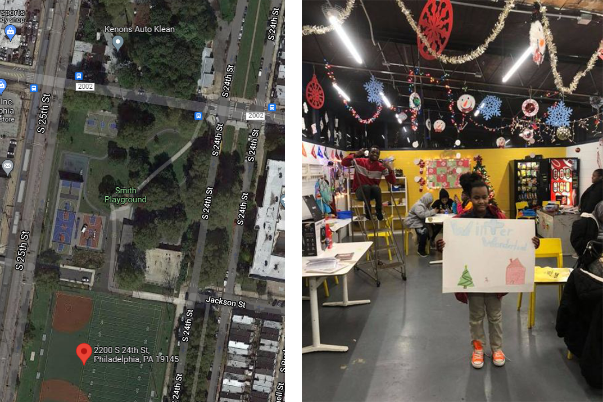
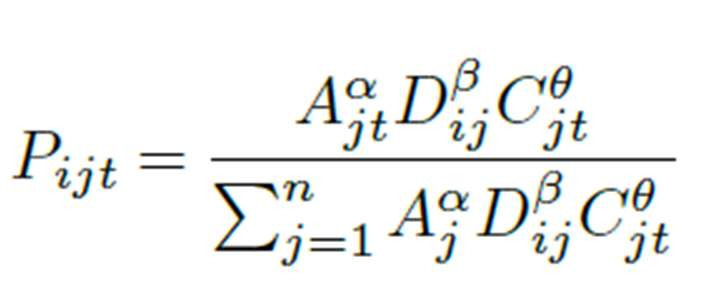

```{=html}
<style>
p.caption {
  font-size: 0.8em;
  text-align: center;
  font-weight: normal;
}
    caption {
      color: grey;
      font-size: 0.8em;
    }
@font-face{
  font-family: Helvetica; 
  src:url('Helvetica.ttf');
}
body{
  font-size: 11pt;
  font-family: Helvetica;
}
h3{
  font-size: 24pt;
  font-family: Helvetica;
}
h4{
  font-size: 21pt;
  font-family: Helvetica;
}
h5{
  font-size: 18pt;
  font-family: Helvetica;
}
td{
  font-size: 9pt;
  font-family: Helvetica;
}
th{
  font-size: 0.8em;
  font-family: Helvetica;
  color: black;
}
</style>
```
```{r setup, include=FALSE}
knitr::opts_chunk$set(echo = TRUE)
```

### 1 Introduction

Currently, the Philadelphia Department of Parks & Recreation (PPR) owns 524 facilities across the city and host thousands of programs and events every year that contribute to the wellness of people.From top down, the hierarchy of their service system includes: Districts, Service Areas, Facilities, Programs and Events.

In the past, staffing in PPR estimates the demand for its programming based on program data (like registered attendance) and other proxy measures about park visits (e.g. total trash collected). However, these measures may not be fully reliable due to limited data resources. How can PPR make smarter decisions about allocating programs in the parks and recreation facilities? We will refer to a data-driven approach to help them find the dynamic relationship between planned activities and visitors.

Only recently, with the dynamic data collected by SafeGraph and other cell phone data carriers, it is now possible to analyze large data sets of cell phone location activity, including where people are traveling and how long they stay. SafeGraph's mobile device panels get anonymous data about users' foot traffic from numerous smartphone apps and could be considered as a selected sample to understand people's travel pattern. These data are further aggregated to answer a series questions like how often do people visit a location or how long do they stay in a location.

By incorporating this novel dataset, we can help the PPR to analyze if their programming meet citizens' demands and to better assign their program resources with SafeGraph's Pattern dataset. With understanding of the imbalance between demand and supply, we can adjust the quantity of programs and events, like increasing number in low-supplied facilities and reducing number in over-supplied facilities. The prediction outcome of market area can be used to suggest PPR's future programming strategies

In order to know how many additional programs are needed and how the adjustment will affect other facilities, we will refer to the Huff Model. In spatial analysis, the Huff model is a widely used tool for predicting the probability of a consumer visiting a site, as a function of the distance of the site, its attractiveness, and the relative attractiveness of alternatives. With the predicted probability of a consumer visiting a facility, we could interpret and normalize it to reflect the quantity of visitors from a census block group to a certain facility. In that case, we can help the PPR better understand the use of their facilities and provide recommendations on how to allocate programming resources better within Program Service Areas and the types of programs they should offer to meet diverse user demands.

The eventually user interface will be the [Dashboard](https://ppr-dashboard-xfw9y.ondigitalocean.app/). That will convey the PPR related information, useful exploratory analysis, and the outcome of market area from the huff model in the end. This dashboard will provide data visualization of their existing programs, permits and estimaed number of visits in each facility, service area, and district, as well as display proposed activities to visitors in the future.

```{r library, message=FALSE, warning=FALSE, results='hide'}

#windowsFonts(font = windowsFont('Helvetica'))

crs = 4326

library(vroom)
library(grid)
library(gridExtra)
library(sf)
library(terra)
library(dplyr)
library(spData)
library(mapview)
library(geosphere)
library(sp)
library(rgeos)
library(ggplot2)
library(ggmap)
library(kableExtra)
library(tidyverse)
library(data.table)
#https://rdrr.io/cran/osrm/man/osrmRoute.html
library(osrm)
library(corrplot)
#remotes::install_github("CityOfPhiladelphia/rphl")
library(rphl)
library(lubridate)
library(furrr)
library(riem)
library(tidycensus)
library(rgdal)
library(furrr)
library(mapview)
library(NbClust)
library(cluster)
library(psych)
ll <- function(dat, proj4 = 4326){st_transform(dat, proj4)}

census_api_key("b33ec1cb4da108659efd12b3c15412988646cbd8", overwrite = TRUE)

root.dir = "https://raw.githubusercontent.com/urbanSpatial/Public-Policy-Analytics-Landing/master/DATA/"
source("https://raw.githubusercontent.com/urbanSpatial/Public-Policy-Analytics-Landing/master/functions.r")

plotTheme <- function(base_size = 9, title_size = 10){
  theme(
    text = element_text( color = "black"),
    plot.title = element_text(size = title_size, colour = "black", hjust = 0.5), 
    plot.subtitle = element_text( face = 'italic',
                                 size = base_size, colour = "black", hjust = 0.5),
    plot.caption = element_text( hjust=0),
    axis.ticks = element_blank(),
    panel.background = element_blank(),
    panel.grid.major = element_line("grey80", size = 0.01),
    panel.grid.minor = element_blank(),
    panel.border = element_rect(colour = "black", fill=NA, size=.5),
    strip.background = element_blank(),
    strip.text = element_text( size=9),
    axis.title = element_text( size=9),
    axis.text = element_text( size=7),
    axis.text.y = element_text( size=7),
    plot.background = element_blank(),
    legend.background = element_blank(),
    legend.title = element_text( colour = "black", face = "italic", size = 9),
    legend.text = element_text( colour = "black", face = "italic", size = 7),
    strip.text.x = element_text( size = 9),
    legend.key.size = unit(.5, 'line')
  )
}

mapTheme <- function(base_size = 9, title_size = 10){
  theme(
    text = element_text( color = "black"),
    plot.title = element_text(size = title_size, colour = "black", hjust = 0.5), 
    plot.subtitle = element_text( face = 'italic',
                                 size = base_size, colour = "black", hjust = 0.5),
    plot.caption = element_text( hjust=0),
    axis.ticks = element_blank(),
    panel.background = element_blank(),
    panel.grid.major = element_blank(),
    panel.grid.minor = element_blank(),
    panel.border = element_blank(),
    strip.background = element_blank(),
    strip.text = element_text(size=base_size),
    axis.title = element_text( size=9),
    axis.text = element_blank(),
    axis.text.y = element_blank(),
    plot.background = element_blank(),
    legend.background = element_blank(),
    legend.title = element_text( colour = "black", face = "italic", size = 9),
    legend.text = element_text( colour = "black", face = "italic", size = 7),
    strip.text.x = element_text(size=base_size),
    legend.key.size = unit(.5, 'line')
  )
}

palette10 <- c("#315d7f","#4f5d7f","#6d5c7e","#a36681","#d96f83","#f2727f","#f6928a","#f8a28f","#f9b294","#fcdc97")
palette9 <- c('#315d7f', '#4f5d7f', '#6d5c7e', '#a36681', '#d96f83', '#f2727f', '#f6928a', '#f8a28f', '#f9b294')
palette7 <- c('#315d7f', '#4f5d7f', '#6d5c7e', '#d96f83', '#f2727f', '#f6928a', '#f9b294')
palette5 <- c("#f9b294","#f2727f","#c06c86","#6d5c7e","#315d7f")
palette4 <- c("#f9b294","#f2727f","#c06c86","#6d5c7e")
palette2 <- c("#f9b294","#f2727f")
palette1_main <- "#F2727F"
palette1_assist <- '#F9B294'
```

#### 1.1 District & Service Area

```{r openData_pprDistrictAndServiceArea, fig.align='center', fig.cap='Location of PPR Districts and Pilot Service Areas', fig.height=8, message=FALSE, warning=FALSE, out.width='80%', results='hide'}

pprDistrict <- st_read('https://opendata.arcgis.com/datasets/0cdc4a1e86c6463b9600f9d9fca39875_0.geojson') %>%
  st_transform(crs)

pprServiceArea <- read_sf(dsn="data/FromPPR/PPR_Service_Areas_2021/PPR_Service_Areas_2021.shp")%>%
  st_transform(crs = crs)

#save as geojson for app
# st_write(pprServiceArea,"pprServiceArea.GEOJSON")

base_map <- get_map(location = unname(st_bbox(ll(st_buffer(st_union(pprDistrict),5000)))),maptype = "terrian")

ggmap(base_map) + 
  geom_sf(data=ll(st_union(pprDistrict)),color="black",size=1,fill = "transparent",inherit.aes = FALSE)+
  geom_sf(data=ll(pprDistrict),color='black',size=1,fill = "transparent",inherit.aes = FALSE)+
  geom_sf(data=ll(pprServiceArea),color='black',size=0.6,fill = "transparent",inherit.aes = FALSE)+
  geom_sf(data=ll(pprDistrict %>% filter(DISTRICTID %in% c(7,8,9))),color=palette1_main,size=1,fill = "transparent",inherit.aes = FALSE)+
  geom_sf(data=ll(pprServiceArea %>% filter(PPR_DIST %in% c(7,8,9))),color=palette1_main,size=0.6,fill = "transparent",inherit.aes = FALSE)+
  labs(title = "", 
       subtitle = "",
       x="",y="")+
  mapTheme()
```

The city is divided into 10 districts. Each district contains several Program Service Areas. PPR allocates staff members to run programs at facilities and parks within a Program Service Area. Besides macro analyses, this practicum focuses on the Districts 7, 8 and 9 per PPR's request. These Districts are part of a pilot that begins in spring 2022. In the Figure1.1.1, the areas highlighted by pink lines are the services areas in District 7,8 and 9.

#### 1.2 Properties

```{r openData_pprProperty,fig.height = 8,message = FALSE, warning = FALSE, results='hide',out.width = '80%',fig.align = 'center',fig.cap = 'Figure1.2.1 Locations of PPR Properties'}
pprProperties <- st_read('https://opendata.arcgis.com/datasets/d52445160ab14380a673e5849203eb64_0.geojson')%>%
  st_transform(crs)

property <- st_join(st_centroid(pprProperties),pprServiceArea,left=TRUE) %>% 
  st_drop_geometry() %>% 
  left_join(pprProperties %>% dplyr::select(OBJECTID,geometry),by='OBJECTID') %>% 
  st_sf() %>% 
  st_transform(crs = crs) %>% 
  dplyr::select(-Shape__Length,-Shape__Area,-Shape_Leng,-Shape_Area) %>% 
  rename('ServiceAreaID' = 'INFO')

#Export to Geojson

#st_write(property,"property.GEOJSON")

ggplot() + 
  geom_sf(data=property,color=palette1_main,fill = palette1_main)+
  geom_sf(data=st_union(pprDistrict),color="black",size=1,fill = "transparent")+
  geom_sf(data=pprDistrict,color="black",size=0.7,linetype ="dashed",fill = "transparent")+
  geom_sf(data=pprDistrict %>% filter(DISTRICTID %in% c(7,8,9)),color="black",size=1,fill = "transparent")+
  labs(title = "", 
       subtitle = "",
       x="",y="")+
  mapTheme()
```

Figure 1.2.1 shows the locations of more than 500 PPR property boundaries in Philadelphia. Notably, some larger parks contain several "child" properties, located wholly inside the "parent" property. For example, 'Wissahickon Valley Park' includes 16 "child-properties ('Wissahickon Valley Park', 'Wissahickon Environmental Center', 'Salvatore Pachella Memorial Field', 'David P Montgomery Field', 'John F Boyce Memorial Field', 'Arrow Field', 'Walnut Lane Golf Club', 'Samuel F Houston Playground', 'Carpenters Woods', 'Dodge Tract', 'Historic Rittenhouse Town', 'Clifford Park', 'Blue Bell Park', 'Saul High School Farm', 'Andorra Natural Area', and 'Saylors Grove').

### 2 Program & Permits Analysis

The activities hold in PPR properties are recorded in two systems: the program schedules and the permit. With the former, the PPR staffing arrange many activities seasonally in different PPR facilities. With the latter, people outside the PPR apply for conducting activities and reserve space in Parks & Recreation areas.

In 2021, the recorded program schedules cover seven categories of After School, Athletic, Camp, Cultural, Educational, Environmental/Outdoor, and other activities. There were other activities applied by volunteer or local residents recorded in the permit system. In the following analyses, events refer to the combination of program and permit data.

#### 2.1 Overall Distribution

In Figure 2.1.1 below, red legends show the locations of facilities with program schedules while orange legends show the distributions of facilities with permit records. Certain amount of permits covering facilities indicates the demand of self-proposed activities and there is a potential to enrich the programming schedules in those areas.

Through the data wrangling, we obtain information like the duration of the events, the attendance of the events etc., recorded by the PPR. Furthermore, we linked program and permit datasets to their based properties and their Program Service Area (which is shown in the following map).

```{r wrangle program data, message=FALSE, warning=FALSE}

permit2021 <- vroom("data/FromPPR/PPR-recreation-permits-2021.csv")
program2021 <- vroom("data/FromPPR/PPR-programs-attended-2021-with-schedules.csv")
facilityID <- read.csv("data/FromPPR/tblFacility_to_PPR_Properties.csv")
facilityIDNOT789 <- read.csv("data/FromPPR/tblFacility_to_PPR_Properties_NOT_789.csv")
facilityID <- facilityID %>% rbind(facilityIDNOT789 %>% rename("PPR_Properties_ObjectID"= "PPR_Properties_ID"))

# define date, filter by attendance date
program2021.clean <- program2021 %>% 
  mutate(AttendanceWeekDate = mdy(AttendanceWeekDate),
         DateFrom = mdy(DateFrom),
         DateTo = mdy(DateTo)) %>% 
  filter(AttendanceWeekDate > DateFrom & AttendanceWeekDate < DateTo)

# original data is recorded by week, here we change it into being recorded by occurence
program2021.clean <- separate(program2021.clean, Days,into= c("1","2","3","4","5","6","7"))

program2021.clean <- program2021.clean %>% 
  gather(colNames, weekday, 15:21) %>% 
  select(-colNames) %>% 
  na.omit(cols='weekday')%>% 
  mutate(AttendenceRealDate = case_when(
    weekday == "Monday" ~ AttendanceWeekDate,
    weekday == "Tuesday" ~ AttendanceWeekDate+1,
    weekday == "Wednesday" ~ AttendanceWeekDate+2,
    weekday == "Thursday" ~ AttendanceWeekDate+3,
    weekday == "Friday" ~ AttendanceWeekDate+4,
    weekday == "Saturday" ~ AttendanceWeekDate+5,
    weekday == "Sunday" ~ AttendanceWeekDate+6,
  ))

# join property,permit and program data
program2021.join <- left_join(program2021.clean, facilityID, by =c("FacilityID" = "FacilityID")) %>% 
  left_join(., property, by =c("PPR_Properties_ObjectID"="OBJECTID"))

permit2021.join <- left_join(permit2021, facilityID, by =c("FacilityID")) %>% 
  left_join(., property, by =c("PPR_Properties_ObjectID"="OBJECTID"))

# filter the failed joining items
# program2021.otherDIstrict <- program2021.join %>% filter(is.na(PPR_Properties_ObjectID))

program2021.otherDIstrict <- program2021.join %>% filter(PPR_DISTRICT == 1| PPR_DISTRICT ==2|PPR_DISTRICT ==3|PPR_DISTRICT ==4|PPR_DISTRICT ==5|PPR_DISTRICT ==6|PPR_DISTRICT ==10)

program2021.join <- program2021.join %>% drop_na(PPR_Properties_ObjectID)

permit2021.otherDIstrict <- permit2021.join %>% filter(is.na(PPR_Properties_ObjectID))

permit2021.join <- permit2021.join %>% drop_na(PPR_Properties_ObjectID)

# Wrangle "program2021.join", and extract month attendance
Facility_Program <- program2021.join %>%
  select(Facility,ActvityTypeCategory,ActivityType,
         AttendanceWeekDate,
         RegisteredIndividualsCount,
         PPR_DISTRICT, PUBLIC_NAME, PARENT_NAME,geometry) %>%
  mutate(month = case_when(month(AttendanceWeekDate)==1 ~ "Jan",
                           month(AttendanceWeekDate)==2 ~ "Feb",
                           month(AttendanceWeekDate)==3 ~ "Mar",
                           month(AttendanceWeekDate)==4 ~ "Apr",
                           month(AttendanceWeekDate)==5 ~ "May",
                           month(AttendanceWeekDate)==6 ~ "Jun",
                           month(AttendanceWeekDate)==7 ~ "Jul",
                           month(AttendanceWeekDate)==8 ~ "Aug",
                           month(AttendanceWeekDate)==9 ~ "Sep",
                           month(AttendanceWeekDate)==10 ~ "Oct",
                           month(AttendanceWeekDate)==11 ~ "Nov",
                           month(AttendanceWeekDate)==12 ~ "Dec")) %>% 
  distinct(.keep_all = FALSE)
# Facility_Program to Geoson
#st_write(Facility_Program,"Facility_Program.GEOJSON")

Facility_Program_otherDistricts <- program2021.otherDIstrict %>%
  select(Facility,ActvityTypeCategory,ActivityType,
         AttendanceWeekDate,
         RegisteredIndividualsCount,
         PUBLIC_NAME, PARENT_NAME,geometry) %>%
  mutate(month = case_when(month(AttendanceWeekDate)==1 ~ "Jan",
                           month(AttendanceWeekDate)==2 ~ "Feb",
                           month(AttendanceWeekDate)==3 ~ "Mar",
                           month(AttendanceWeekDate)==4 ~ "Apr",
                           month(AttendanceWeekDate)==5 ~ "May",
                           month(AttendanceWeekDate)==6 ~ "Jun",
                           month(AttendanceWeekDate)==7 ~ "Jul",
                           month(AttendanceWeekDate)==8 ~ "Aug",
                           month(AttendanceWeekDate)==9 ~ "Sep",
                           month(AttendanceWeekDate)==10 ~ "Oct",
                           month(AttendanceWeekDate)==11 ~ "Nov",
                           month(AttendanceWeekDate)==12 ~ "Dec")) %>%
  distinct(.keep_all = FALSE)

# Aggregate weekly visites
WeekVisit <- aggregate(
  RegisteredIndividualsCount ~ AttendanceWeekDate + ActvityTypeCategory + PPR_DISTRICT, data = Facility_Program, FUN = sum)

# save permit2021.join to geojson
#st_write(permit2021.join,"permit2021.join.GEOJSON")

# save program2021.join to geojson
#st_write(program2021.join,"program2021.join.GEOJSON")
```

```{r programNpermit,fig.height = 8,message = FALSE, warning = FALSE, results='hide',out.width = '80%',fig.align = 'center',fig.cap = 'Figure2.1.1 Facilities w/ Programmed (red) & Permited (orange) Activities across Philly'}

ggplot()+
  geom_sf(data=pprServiceArea,color='black',size=0.25,linetype ="dashed", fill= "transparent")+
  geom_sf(data=pprDistrict,color="black",size=1,fill = "transparent")+
  geom_sf(data=permit2021.join,aes(geometry = geometry),color =palette1_assist,fill = palette1_assist, alpha = 0.7) +
  geom_sf(data=program2021.join,aes(geometry = geometry),color = palette1_main,fill = palette1_main,alpha = 0.7)+
  labs(title="")+
  mapTheme()
```

#### 2.2 District 7,8,9

##### District 7

There are three facilities with programs scheduled in District 7: Athletic Recreation Center, Mander Playground, and Marian Anderson Recreation Center. Orange legends of facilities with permit are not discussed in Chapter 2.

```{r SA7_programNpermit,fig.height = 8,message = FALSE, warning = FALSE, results='hide',out.width = '80%',fig.align = 'center',fig.cap = 'Figure2.2.2 Facilities w/ Programed (red) & Permitted (orange) Activities in District 7'}
ggplot()+
  geom_sf(data=st_union(pprServiceArea %>% filter(PPR_DIST ==7)),color="black",size=1,fill = "transparent")+
  geom_sf(data=pprServiceArea %>% filter(PPR_DIST ==7),color="black",linetype ="dashed",size=1,fill = "transparent")+
  geom_sf(data=permit2021.join%>% filter(PPR_DISTRICT ==7),aes(geometry = geometry),color =palette1_assist,fill = palette1_assist, alpha = 0.7) +
  geom_sf(data=program2021.join%>% filter(PPR_DISTRICT ==7),aes(geometry = geometry),color = palette1_main,fill = palette1_main,alpha = 0.7)+
  labs(title="")+
  mapTheme()
```

```{r SA7_Events,fig.height = 5,message = FALSE, warning = FALSE, results='hide',out.width = '100%',fig.align = 'center',fig.cap = 'Figure2.2.3 Categories of Events in District7'}
plot1 <- ggplot(Facility_Program %>%filter(PPR_DISTRICT == 7)) +
  geom_bar(aes(x= Facility,fill = ActvityTypeCategory),position="stack")+
  scale_fill_manual(values = palette5)+ 
  labs(y = "Program Frequency", fill="Category", title = "")+
  plotTheme()+
  theme(legend.position = "bottom",
        axis.text.x = element_text(angle = 45, hjust = 1, size = 8),
        legend.text = element_text( colour = "black", face = "italic", size = 8))

plot2 <- ggplot(Facility_Program %>%filter(PPR_DISTRICT == 7)) + 
  geom_bar(aes(x= Facility, fill = ActivityType),position="stack")+
  scale_fill_manual(values = palette7)+
  labs(y = "Program Frequency", fill="sub-Category", title = "")+ 
  plotTheme()+
  theme(legend.position = "bottom",
        axis.text.x = element_text(angle = 45, hjust = 1, size = 8),
        legend.text = element_text( colour = "black", face = "italic", size = 8))

grid.arrange(plot1, plot2,ncol=2,top = "")
```

In Figure 2.2.3, we can see that **Marian Anderson Recreation Center** held more activities in the **athletic** category, like soccer and baseball. **The other two** facilities hold more **cultural** activities, like art and music.

```{r SA7_Events 2,fig.height = 5,message = FALSE, warning = FALSE, results='hide',out.width = '80%',fig.align = 'center',fig.cap = 'Figure2.2.4 Visitor Counts by Week and Activity Categories in District 7'}
ggplot(WeekVisit %>%filter(PPR_DISTRICT == 7)) +
  geom_line(size=0.5,aes(x = AttendanceWeekDate, y = RegisteredIndividualsCount, group = ActvityTypeCategory, colour = ActvityTypeCategory)) +
  geom_point(aes(x = AttendanceWeekDate, y = RegisteredIndividualsCount, group = ActvityTypeCategory, colour = ActvityTypeCategory, size = RegisteredIndividualsCount)) +
  scale_color_manual(values = palette5)+
  scale_size_continuous(range = c(2, 4))+
  labs(title = "",
       color = "Program Category",
       size="Visitor Counts",
       x = "Week of the Year",
       y = "Visitor Counts")+
  plotTheme()+
    theme(axis.text.x = element_text( hjust = 1, size = 8),
        axis.text.y = element_text( hjust = 1, size = 8),
        legend.text = element_text( colour = "black", size = 8))

# save WeekVisit to geojson
#st_write(WeekVisit,"WeekVisit.GEOJSON")
```

In the Figure 2.2.4, we can see that **Athletic** activities were hold from **March to November** while **cultural** and **after school** activities mostly took place in **fall**.

##### District 8

There are five facilities with programs scheduled in District 8: 48th & Woodland Playground, Christy Recreation Center, Howards S. Morris Recreation Center, Laura Sims Skate House, and Shepard Recreation Center. Orange legends of facilities with permits are not discussed in Chapter 2.

```{r SA8_programNpermit,fig.height = 8,message = FALSE, warning = FALSE, results='hide',out.width = '80%',fig.align = 'center',fig.cap = 'Figure2.2.5 Facilities w/ Programed (red) & Permitted (orange) Activities in District 8'}
ggplot()+
  geom_sf(data=st_union(pprServiceArea %>% filter(PPR_DIST ==8)),color="black",size=1,fill = "transparent")+
  geom_sf(data=pprServiceArea %>% filter(PPR_DIST ==8),color="black",linetype ="dashed",size=1,fill = "transparent")+
  geom_sf(data=permit2021.join%>% filter(PPR_DISTRICT ==8),aes(geometry = geometry),color =palette1_assist,fill = palette1_assist, alpha = 0.7) +
  geom_sf(data=program2021.join%>% filter(PPR_DISTRICT ==8),aes(geometry = geometry),color = palette1_main,fill = palette1_main,alpha = 0.7)+
  labs(title="")+
  mapTheme()
```

```{r SA8_Events,fig.height = 5,message = FALSE, warning = FALSE, results='hide',out.width = '100%',fig.align = 'center',fig.cap = 'Figure2.2.6 Categories of Events in District8'}
plot1 <- ggplot(Facility_Program %>%filter(PPR_DISTRICT == 8)) +
  geom_bar(aes(x= Facility,fill = ActvityTypeCategory),position="stack")+
  scale_fill_manual(values = palette5)+
  labs(y = "Program Frequency", fill="Category", title = "")+
  plotTheme()+
  theme(axis.text.x = element_text(angle = 45, hjust = 1, size = 8),
        legend.position = "bottom",
        legend.text = element_text( colour = "black", face = "italic", size = 8))

plot2 <- ggplot(Facility_Program %>%filter(PPR_DISTRICT == 8)) + 
  geom_bar(aes(x= Facility, fill = ActivityType),position="stack")+
  scale_fill_manual(values = palette9)+
  labs(y = "Program Frequency", fill="sub-Category", title = "")+ 
  plotTheme()+
  theme(axis.text.x = element_text(angle = 45, hjust = 1, size = 8),
        legend.position = "bottom",
        legend.text = element_text( colour = "black", face = "italic", size = 8))

grid.arrange(plot1, plot2,ncol=2,top = "")
```

In Figure 2.2.6 we can see that **Laura Sims Skate House** held hockey and **ice skating** activities, while **Morris Recreation Center** hosted more **cultural** activities like dance as well as **athletic** activities of gymnastics, tumbling and basketball.

```{r SA8_Events 2,fig.height = 5,message = FALSE, warning = FALSE, results='hide',out.width = '80%',fig.align = 'center',fig.cap = 'Figure2.2.7 Visitor Counts by Week and Activity Categories in District 8'}
ggplot(WeekVisit %>%filter(PPR_DISTRICT == 8)) +
  geom_point(aes(x = AttendanceWeekDate, y = RegisteredIndividualsCount, group = ActvityTypeCategory, colour = ActvityTypeCategory, size = RegisteredIndividualsCount)) +
  geom_line(size=0.5,aes(x = AttendanceWeekDate, y = RegisteredIndividualsCount, group = ActvityTypeCategory, colour = ActvityTypeCategory)) +
  scale_color_manual(values = palette5)+
  scale_size_continuous(range = c(2, 4))+
  labs(title = "",
       color = "Program Category",
       size="Visitor Counts",
       x = "Week of the Year",
       y = "Visitor Counts")+
  plotTheme()+
  theme(legend.text = element_text( colour = "black", size = 8))
```

In Figure 2.2.7 we can see that **Hockey and ice skating** activities take place in **fall, winter and spring**, while **cultural and after school** activities are mainly held in **fall**.

##### District 9

There are 7 facilities with programs scheduled in District 9: Barry Playground and Pool, Cibotti Recreation Center, DiSilvestro Playground, East Passyunk Community Center, Eastwick Regional Playground, and Thomas B. Smith Recreation Center. Orange legends of facilities with permit are not discussed in Chapter 2.

```{r SA9_programNpermit,fig.height = 8,message = FALSE, warning = FALSE, results='hide',out.width = '80%',fig.align = 'center',fig.cap = 'Figure2.2.8 Facilities w/ Programed (red) & Permitted (orange) Activities in Disdrict 9'}

ggplot()+
  geom_sf(data=st_union(pprServiceArea %>% filter(PPR_DIST ==9)),color="black",size=1,fill = "transparent")+
  geom_sf(data=pprServiceArea %>% filter(PPR_DIST ==9),color="black",linetype ="dashed",size=1,fill = "transparent")+
  geom_sf(data=permit2021.join%>% filter(PPR_DISTRICT ==9),aes(geometry = geometry),color =palette1_assist,fill = palette1_assist, alpha = 0.7) +
  geom_sf(data=program2021.join%>% filter(PPR_DISTRICT ==9),aes(geometry = geometry),color = palette1_main,fill = palette1_main,alpha = 0.7)+
  labs(title="")+
  mapTheme()
```

In Figure 2.2.9 we can see that Athletic activities of basketball and aquatics mostly took place in Barry Playground and Pool and East Passyunk Community Center. Eastwick Regional Playground, and Thomas B. Smith Recreation Center are the two most popular facilities with activities of athletic, after school, cultural, educational, and other categories.

```{r SA9_Events,fig.height = 5,message = FALSE, warning = FALSE, results='hide',out.width = '80%',fig.align = 'center',fig.cap = 'Figure2.2.9 Facility & Program Categories in District 9'}
ggplot(Facility_Program %>%filter(PPR_DISTRICT == 9)) +
  geom_bar(aes(x= Facility,fill = ActvityTypeCategory),position="stack")+
  scale_fill_manual(values = palette7[2:7])+
  labs(y = "Program Frequency", fill="Category", title = "")+
  plotTheme()+
  theme(axis.text.x = element_text(angle = 45, hjust = 1, size = 8),
        legend.position = "bottom",
        legend.text = element_text( colour = "black", size = 8))
```

```{r SA9_Events 2,fig.height = 5,message = FALSE, warning = FALSE, results='hide',out.width = '80%',fig.align = 'center',fig.cap = 'Figure2.2.10 Visitor Counts by Week and Activity Categories in District 9'}
ggplot(WeekVisit %>%filter(PPR_DISTRICT == 9)) +
  geom_point(aes(x = AttendanceWeekDate, y = RegisteredIndividualsCount, group = ActvityTypeCategory, colour = ActvityTypeCategory, size = RegisteredIndividualsCount)) +
  geom_line(size=0.5,aes(x = AttendanceWeekDate, y = RegisteredIndividualsCount, group = ActvityTypeCategory, colour = ActvityTypeCategory)) +
  scale_color_manual(values = palette7[2:7])+
  scale_size_continuous(range = c(2, 4))+
  labs(title = "",
       color = "Program Category",
       size="Visitor Counts",
       x = "Week of the Year",
       y = "Visitor Counts")+
  plotTheme()+
    theme(legend.text = element_text( colour = "black", size = 8))
```

In Figure 2.2.10 indicates that **Athletic** activities took place throughout the **whole year**, while other categories of activities, like older adults and mentoring, were held in the 2nd half of the year. **Cultural** activities, like art, dance, music, **usually suspended in summer.**

#### 2.3 Other Districts

In Figure2.3.1 there are 27 facilities with programs scheduled in other districts of PPR serving areas.

```{r SAOthers_Events,fig.height = 5,message = FALSE, warning = FALSE, results='hide',out.width = '100%',fig.align = 'center',fig.cap = 'Figure2.3.1 Facility & Program Categories in other Districts'}

ggplot(Facility_Program_otherDistricts) +
  geom_bar(aes(x= Facility,fill = ActvityTypeCategory),position="stack")+
  scale_fill_manual(values = palette7)+
  labs(y = "Program Frequency", fill="Program Category", title = "")+
  plotTheme()+
  theme(axis.text.x = element_text(angle = 45, hjust = 1, size = 8),
        legend.position = "bottom",
        legend.text = element_text( colour = "black", face = "italic", size = 8))

```

### 3 SafeGraph Data Analysis

This project aims to use SafeGraph's Pattern dataset to analyze whether PPR programmings achieve their goals of meeting citizens' demands and serving them well. Further, SafeGraph data can be used to suggest PPR's future programming strategies in Philadelphia.

SafeGraph's Patterns dataset includes visitor and visit aggregations for points of interest (POIs) in the US. This contains aggregated raw counts of visits to POIs from a panel of mobile devices, answering how often people visit, how long they stay (dwelling time), where they came from (origin), where else they go (departure), and more. [More Information](https://docs.safegraph.com/docs/monthly-patterns#:~:text=Patterns%20is%20a%20dataset%20of,in%20Canada%2C%20see%20Weekly%20Patterns.)

```{r read SafeGraph Data and filter SafeGraph Data,warning=FALSE,message=FALSE, results='hide'}
# brand_info <- vroom("data/safegraph/Philadelphia-Camden-WilmingtonPA-NJ-DE-MDMSA-CORE_POI-2021_11-2021-12-17/brand_info.csv")
# core_poi <- vroom("data/safegraph/Philadelphia-Camden-WilmingtonPA-NJ-DE-MDMSA-CORE_POI-2021_11-2021-12-17/core_poi.csv")
# 
# monthList = c("01","02","03","04","05","06","07","08","09","10","11")
# 
# patternAllMonth = data.frame()
# for (i in monthList){
#   currentMonth = vroom(paste("data/safegraph/SafeGraph Data Purchase Dec-16-2021/Philadelphia-Camden-WilmingtonPA-NJ-DE-MDMSA-PATTERNS-2021_",
#        i,
#        "-2021-12-17/patterns.csv.gz",sep = ""))%>%
#     filter(region=="PA")%>%
#     mutate(month=paste(i,sep = ""))
#   patternAllMonth = rbind(patternAllMonth,currentMonth)
# }
# 
# # filter into philly, join with POI data
# safeGraph <- patternAllMonth %>%
#   filter(city == "Philadelphia")%>%
#   left_join(core_poi %>% dplyr::select(placekey,location_name,top_category,sub_category,naics_code,latitude,longitude),
#             by=c("placekey"="placekey","location_name" = "location_name"),keep=FALSE)
# 
# # create geometry from lat & lng
# safeGraph.geo <-
#   safeGraph %>%
#   st_as_sf(coords = c("longitude", "latitude"), crs = crs, agr = "constant", na.fail=FALSE)


# patternAllMonth <- st_read("data/output/patternAllMonth.csv")
#st_write(safeGraph.geo,"data/output/safeGraph.geo.GeoJSON")
safeGraph.geo <- st_read("data/output/safeGraph.geo.GeoJSON",crs = crs)

# change workers number by yourself
plan(multiprocess, workers = 10)

# keep congeneric bussiness
congenericMoves <-
  safeGraph.geo %>%
  filter(top_category %in% c("Promoters of Performing Arts, Sports, and Similar Events","Other Amusement and Recreation Industries","Museums, Historical Sites, and Similar Institutions") | str_detect(location_name, "Park") | str_detect(location_name, "Playground") | str_detect(location_name, "Recreation Center")) %>%
  filter(str_detect(location_name, "Parking", negate = TRUE))

# Keep only ppr sites
parks <- safeGraph.geo %>% 
  dplyr::select(placekey, naics_code, location_name) %>% 
  distinct() %>% 
  filter(naics_code %in% c(712190, 713990, 713940, 711310) | str_detect(location_name, "Park") | str_detect(location_name, "Playground") | str_detect(location_name, "Recreation Center")) %>%
  filter(str_detect(location_name, "Parking", negate = TRUE)) %>% 
  st_transform(crs = 4326)

PPRmoves <- safeGraph.geo %>% 
  filter(placekey %in% as.list(parks$placekey))
```

In the above data wrangling, we first combine all 11-month pattern data from SafeGraph dataset, attaching them with geometry information. Further, we filter the data into Pennsylvania region and Project-related POIs using [NAICS code](https://www.naics.com/code-search/?naicstrms=park). The NAICS codes we chose are as follow.

712190: Nature Parks and Other Similar Institutions; <br> 713990: All Other Amusement and Recreation Industries; <br> 713940: Fitness and Recreational Sports Centers；<br> 711310：Promoters of Performing Arts, Sports, and Similar Events

```{r update property and program data with placekey,message = FALSE, warning = FALSE}
# join filtered safeGraph place with ppr property
propertyWithPlaceKey <- st_join(property %>% filter(NESTED == "N") %>% st_transform(crs=32118),
                                st_buffer(parks %>% drop_na() %>% dplyr::select(placekey, geometry) %>% st_transform(crs=32118),10)) %>%
  st_drop_geometry() %>% 
  left_join(property %>% dplyr::select(OBJECTID),by=('OBJECTID'='OBJECTID')) %>% 
  st_sf() %>% 
  st_transform(crs=crs) %>% 
  drop_na(placekey)
#st_write(propertyWithPlaceKey, "data/output/dashboard/SitesRelation_PPR_SG.GeoJSON")

# back up geometry information
program2021.joinGEO <- program2021.join %>% dplyr::select(FacilityID,geometry) %>% distinct()
permit2021.joinGEO <- permit2021.join %>% dplyr::select(FacilityID,geometry) %>% distinct()

program2021.joinWithPlaceKey <- st_join(program2021.join %>%
            st_sf() %>% 
            st_transform(crs=32118),
          propertyWithPlaceKey %>% 
            st_transform(crs=32118) %>% 
            mutate(Parent_ID = OBJECTID) %>% 
            dplyr::select(Parent_ID, placekey, geometry)
          ,left=FALSE, join=st_contains) %>%
  st_drop_geometry() %>% 
  left_join(program2021.joinGEO,
              by='FacilityID')%>%
  st_sf() %>% 
  st_transform(crs=crs)

permit2021.joinWithPlaceKey <- st_join(permit2021.join %>%
            st_sf() %>% 
            st_transform(crs=32118),
          propertyWithPlaceKey%>% 
            st_transform(crs=32118) %>% 
            mutate(Parent_ID = OBJECTID) %>% 
            dplyr::select(Parent_ID, placekey, geometry),
          left=FALSE, join=st_contains) %>% 
  st_drop_geometry() %>% 
  left_join(permit2021.joinGEO,
              by='FacilityID')%>%
  st_sf() %>% 
  st_transform(crs=crs)
```

<center>

```{r update property and program data with placekey 2, echo=FALSE, fig.align='center', fig.height=8, message=FALSE, warning=FALSE, out.width='80%'}
propertyWithPlaceKeyJustToPlot = propertyWithPlaceKey %>% distinct(OBJECTID,.keep_all = TRUE)
mapview(property,layer.name = c("All PPR Facilities"))+mapview(propertyWithPlaceKeyJustToPlot,col.regions = "green",layer.name = c("Sucessfully Joined Facilities"))+mapview(st_centroid(parks),col.regions = "red",layer.name = c("Safegraph Points"))
```

</center>

Through data wrangling, we use spatial join to link the filtered SafeGraph POIs with PPR facilities and PPR programmings & permits. So far we have successfully bridged the channel of communicating among these three main datasets. In the above map, the purple polygons are the all properties of PPR, the green dots are the successfully joined properties with placekey. The map shows most of the PPR facilities are joined successfully.

```{r unnest safegraph data, message=FALSE, warning=FALSE, results='hide'}
placeKeyNeeded = unique(propertyWithPlaceKey$placekey)
PPRmoves <- PPRmoves %>% filter(placekey %in% placeKeyNeeded)
# unnest visit Count data
# visitCount <-
#   PPRmoves %>%
#   select(placekey, date_range_start, date_range_end, visits_by_day) %>%
#   mutate(date_range_start = as_date(date_range_start),
#          date_range_end = as_date(date_range_end)) %>%
#   dplyr::select(-date_range_end) %>%
#   mutate(visits_by_day = future_map(visits_by_day, function(x){
#     unlist(x) %>%
#       as_tibble() %>%
#       rowid_to_column(var = "day") %>%
#       mutate(visits = value) %>%
#       dplyr::select(-value)
#   })) %>%
#   unnest(cols = c("visits_by_day"))
# visitCount <- visitCount %>%
#     rename(visitDay = date_range_start) %>%
#     mutate(visitDay = day+visitDay-1) %>%
#     mutate(month = month(visitDay))
# st_write(visitCount,"data/output/visitCount.GeoJSON")
visitCount <- st_read("data/output/visitCount.GeoJSON",crs=crs)

# unnest popularity_by_hour data
# visitHour <-
#   PPRmoves %>%
#   select(placekey, popularity_by_hour, date_range_start) %>%
#   mutate(date_range_start = as_date(date_range_start),
#          month =  month(date_range_start)) %>%
#   dplyr::select(-date_range_start) %>%
#   mutate(popularity_by_hour = future_map(popularity_by_hour, function(x){
#     unlist(x) %>%
#       as_tibble() %>%
#       rowid_to_column(var = "hour") %>%
#       rename(visit = value)
#   }))%>%
#   unnest(popularity_by_hour)
# 
# st_write(visitHour,"data/output/visitHour.GeoJSON")
visitHour <- st_read("data/output/visitHour.GeoJSON",crs=crs)


# unnest the origin-destination data

# originCount <-
#   PPRmoves %>%
#   select(placekey, visitor_home_cbgs, date_range_start) %>%
#   mutate(date_range_start = as_date(date_range_start),
#          month =  month(date_range_start)) %>%
#   dplyr::select(-date_range_start) %>%
#   mutate(visitor_home_cbgs = future_map(visitor_home_cbgs, function(x){
#     jsonlite::fromJSON(x) %>%
#       as_tibble() %>%
#       dplyr::select(starts_with("4")) %>%
#       gather()
#   })) %>%
#   unnest(visitor_home_cbgs) %>%
#   rename(origin =key ,visitors= value)
# 
# st_write(originCount,"data/output/originCount.GeoJSON")
originCount <- st_read("data/output/originCount.GeoJSON",crs=crs)


#unnest the departure - destination data
# departCount <-
#   PPRmoves %>%
#   select(placekey, visitor_daytime_cbgs, date_range_start) %>%
#   mutate(date_range_start = as_date(date_range_start),
#          month =  month(date_range_start)) %>%
#   dplyr::select(-date_range_start) %>%
#   mutate(visitor_daytime_cbgs = future_map(visitor_daytime_cbgs, function(x){
#     jsonlite::fromJSON(x) %>%
#       as_tibble() %>%
#       dplyr::select(starts_with("4")) %>%
#       gather()
#   }))%>%
#   unnest(visitor_daytime_cbgs) %>%
#   rename(departure =key ,visitors= value)
# 
# st_write(departCount,"data/output/departCount.GeoJSON")
departCount <- st_read("data/output/departCount.GeoJSON",crs=crs)

# unnest the bucketed_dwell_times data
# dwellTime <-
#   PPRmoves %>%
#   select(placekey, bucketed_dwell_times, date_range_start) %>%
#   mutate(date_range_start = as_date(date_range_start),
#          month =  month(date_range_start)) %>%
#   dplyr::select(-date_range_start) %>%
#   mutate(bucketed_dwell_times = future_map(bucketed_dwell_times, function(x){
#     jsonlite::fromJSON(x) %>%
#       as_tibble() %>%
#       gather()
#   }))%>%
#   unnest(bucketed_dwell_times) %>%
#   rename(dwellTimes =key ,visitors= value)
# 
# st_write(dwellTime,"data/output/dwellTime.GeoJSON")
dwellTime <- st_read("data/output/dwellTime.GeoJSON",crs=crs)


# unnest the related_same_day_brand
# relatedBrand <-
#   PPRmoves %>%
#   select(placekey, related_same_day_brand, date_range_start) %>%
#   mutate(date_range_start = as_date(date_range_start),
#          month =  month(date_range_start)) %>%
#   dplyr::select(-date_range_start) %>%
#   mutate(related_same_day_brand = future_map(related_same_day_brand, function(x){
#     jsonlite::fromJSON(x) %>%
#       as_tibble() %>%
#       gather()
#   }))
# 
# relatedBrand <- relatedBrand %>%
#   unnest(related_same_day_brand) %>%
#   rename(relatedBrand =key ,visitors= value)
# 
# st_write(relatedBrand,"data/output/relatedBrand.GeoJSON")
relatedBrand <- st_read("data/output/relatedBrand.GeoJSON",crs=crs)


# unnest the popularity_by_day data
# visitWeekday <-
#   PPRmoves %>%
#   select(placekey, popularity_by_day, date_range_start) %>%
#   mutate(date_range_start = as_date(date_range_start),
#          month =  month(date_range_start)) %>%
#   dplyr::select(-date_range_start) %>%
#   mutate(popularity_by_day = future_map(popularity_by_day, function(x){
#     jsonlite::fromJSON(x) %>%
#       as_tibble() %>%
#       gather()
#   }))%>%
#   unnest(popularity_by_day) %>%
#   rename(visitWeekday =key ,visits= value)
# 
# st_write(visitWeekday,"data/output/visitWeekday.GeoJSON")
visitWeekday <- st_read("data/output/visitWeekday.GeoJSON",crs=crs)
```

Because SafeGraph data is nested within the dataframe. To use this data in further analyses, we have to release them into respective dataframes. Through the above data wrangling, we obtain information like number of visits to these facilities by day, the number of visits to these facilities by hour, the number of visits to these facilities by weekday, the census block groups of these visitors' home, the census block groups of these visitors' departure places, the distribution of these visits' dwelling time etc.

Notably, the **visits** here refer to the visits in **SafeGraph Mobile Device Panel instead of the true visits** to these facilities, considering that these data have been filtered and privacy-screened. Even though there might be some [biases](https://www.safegraph.com/blog/what-about-bias-in-the-safegraph-dataset) in the representatives, we still believe this data can give us insights about the pattern of actual visits. However, some data rectifications are still deployed in the following to make it more reliable.

#### 3.1 Bias Analysis and Data Rectification

Sometimes, SafeGraph will count "Residents" or "passer-bys" as "visitors", which will result in huge bias and mislead the analysis. So, to conclude **typical position types of SafeGraph data bias**, we choose ***midnight visits***and ***dwelling time*** as factors for **cluster analysis**. We also apply principal component analysis here to assist in understanding characteristics of clusters.

```{r integrate safegraph data with their characteristic, eval=FALSE}
# calculate midnight visit
visitHourNight <- visitHour %>% 
  filter(hour >= 1 | hour <=5) %>% 
  group_by(placekey) %>% 
  summarize(nightVisit = sum(visit))


# integrate sg data by midnight visit and dwell time
visitIntegrated <- full_join(visitHourNight %>% 
                               st_drop_geometry(), 
                             dwellTime %>% 
                               group_by(placekey, dwellTimes) %>% 
                               summarize(visitors = sum(visitors)),
                             by=c('placekey'))

# wide format
visitIntegrated <- visitIntegrated %>% 
  spread(key = dwellTimes, value = visitors)

# export
# st_write(visitIntegrated, "data/output/visitIntegrated.GeoJSON")
```

```{r cluster by data confidence,warning=FALSE,message=FALSE, results='hide'}
# import
visitIntegrated <- st_read("data/output/visitIntegrated.GeoJSON") %>% 
  rename(c("Dwell<5"="X.5","Dwell>240"="X.240","Dwell11-20"="X11.20","Dwell121-240"="X121.240","Dwell21-60"="X21.60","Dwell5-10"="X5.10","Dwell61-120"="X61.120" ))

visitIntegrated <- visitIntegrated[,c(1,2,3,8,5,7,9,6,4)]

# normalize
visitIntegrated.scale <- scale(visitIntegrated %>% 
                                 dplyr::select(-placekey) %>% 
                                 st_drop_geometry())

set.seed(12)
# decide cluster number (only run once)

#nc <- NbClust(visitIntegrated.scale, min.nc=2, max.nc=15, method="kmeans", index="all")
#table(nc$Best.n[1,])
# 
# barplot(table(nc$Best.n[1,]),
#         xlab="Numer of Clusters", ylab="Number of Criteria",
#         main="Number of Clusters Chosen by 26 Criteria")


# Run K-Means cluster
cluster1 <- kmeans(visitIntegrated.scale, 3) 
#summary(cluster1)

# add cluster number back
visitIntegrated <- visitIntegrated %>% 
  mutate(cluster = cluster1$cluster)

# mean by cluster
cluster1_mean <- aggregate(visitIntegrated %>% 
                             dplyr::select(-placekey, -cluster) %>% 
                             st_drop_geometry(),
                       by=list(cluster=visitIntegrated$cluster),
                       FUN=mean) %>% 
  left_join(visitIntegrated %>% 
              st_drop_geometry() %>% 
              group_by(cluster) %>% 
              summarize(size = n()),
            by="cluster")

kable(cluster1_mean,align = 'c',caption = '<center>Table 1. Mean values of clusters for SafeGraph data <center/>') %>%
  kable_classic(full_width = T)%>%
  kable_styling(position = "center")

```

```{r correlation matrix for cluster1, fig.height = 8,message = FALSE, warning = FALSE,out.width ='80%',fig.align = 'center',fig.cap = 'Figure3.1.1 Correlation Matrix of SafeGraph Bias'}
## put histograms on the diagonal
panel.hist <- function(x, ...)
{
    usr <- par("usr"); on.exit(par(usr))
    par(usr = c(usr[1:2], 0, 1.5) )
    h <- hist(x, plot = FALSE)
    breaks <- h$breaks; nB <- length(breaks)
    y <- h$counts; y <- y/max(y)
    rect(breaks[-nB], 0, breaks[-1], y, ...)
}

#Color points by groups
my_cols <- c(palette5[5],palette5[4],palette5[1])

pairs(visitIntegrated %>% 
        st_drop_geometry() %>% 
        mutate(`Dwel<10`=`Dwell<5`+`Dwell5-10`,
               `Dwell11-120` = `Dwell11-20` + `Dwell21-60` + `Dwell61-120`,
               `Dwell>120` =  `Dwell121-240` + `Dwell>240`) %>% 
        dplyr::select(nightVisit, `Dwel<10`, `Dwell11-120`, `Dwell>120`), 
      pch = 19,  cex = 0.5, cex.labels=1, diag.panel = panel.hist,
      col = my_cols[visitIntegrated$cluster],
      lower.panel=NULL, panel = panel.smooth)

```

Taking results of cluster analysis, most locations, **1094** out of 1117, belong to **cluster 3** with **reliable** data. According to Figure3.1.1, **Cluster 2** includes **14** places with extremely **more night visits and long visits** that are more than 2 hours. **Cluster 1** consists of **9** locations with **many transitory visits** that are less than 10 minutes.

```{r clusplot1, fig.height = 8,message = FALSE, warning = FALSE,out.width ='80%',fig.align = 'center',fig.cap = 'Figure3.1.2 Cluster Plot with Main Component'}
# x <- clusplot(visitIntegrated.scale, 
#          cluster1$cluster, color=TRUE, shade=TRUE, main = "",
#          labels=5, lines=0, stand=TRUE, col.txt=palette5[1:3], col.clus=palette5[1:3], col.p=palette5[5])
```

We can visualize these clusters more simply with the help of principal component analysis (Figure3.1.2 ). It can be seen that cluster 3, normal data, has a large number and is concentrated, while the problematic clusters 2 and 3 have a smaller number and a larger distribution range.

```{r component analysis1,message = FALSE, warning = FALSE}
# decide component number - 2 (only run once)
# fa.parallel(as.data.frame(visitIntegrated.scale), fa = 'pc', n.iter = 100, show.legend = FALSE)

# principal component analysis
set.seed(1234)
cluster1_pca <- principal(visitIntegrated.scale, nfactors = 2, rotate = "none", scores = TRUE)

options(digits = 2) 

kable(t(cluster1_pca$Structure[1:8,1:2]),align = 'c',caption = '<center>Table 3.1.1 Correlations between variables and components <center/>') %>%
  kable_classic(full_width = T)%>%
  kable_styling(position = "center")

```

Table 3.1.1 shows how two components are made up. Basically, the visit amount during the midnight or last more than 20 minutes heavily contribute to component 1 (**miscount resident as visitors**), while short visits that are less than 10 minutes more contribute to component 2 (**overestimate short visits**). So many analysis in this report has **grouped dwell time into 3 span,** \<10min 11-120 min, and \>120min.

```{r rectify sg data,message=FALSE,warning=FALSE,results='hide'}
# cluster info
cluster <- visitIntegrated %>% 
              st_drop_geometry() %>%
              dplyr::select(placekey, cluster)

# caculate the ratio to trim "Dwell5-10" for cluster 1
Sum <- visitIntegrated %>% 
  st_drop_geometry() %>% 
  mutate(Total = `Dwell<5`+`Dwell5-10`+`Dwell11-20`+`Dwell21-60`+`Dwell61-120`+`Dwell121-240`+`Dwell>240`) %>% 
  group_by(cluster) %>% 
  summarize(`Dwell5-10` = sum(`Dwell5-10`),
            `Dwell<5` = sum(`Dwell<5`),
            Total = sum(Total))

ratio5To10 <- Sum[3,]$`Dwell5-10`/Sum[3,]$Total

group1.dwell <- dwellTime %>% 
  st_drop_geometry() %>% 
  spread(key=dwellTimes, value = visitors) %>% 
  left_join(visitIntegrated %>% dplyr::select(placekey, cluster) %>% st_drop_geometry(), by="placekey") %>% 
  filter(cluster==1) %>% 
  mutate(Total = `<5`+`5-10`+`11-20`+`21-60`+`61-120`+`121-240`+`>240`,
         `rectified5-10`=ifelse((`5-10`-ratio5To10*Total/(ratio5To10-1)/`5-10`)<=`5-10`,
                                `5-10`-ratio5To10*Total/(ratio5To10-1)/`5-10`,
                                `5-10`),
         `rectified5-10rate`=`rectified5-10`/Total,
         `<5rate`=`<5`/Total)

group23.dwell <- dwellTime %>% 
  st_drop_geometry() %>% 
  spread(key=dwellTimes, value = visitors) %>% 
  mutate(Total = `<5`+`5-10`+`11-20`+`21-60`+`61-120`+`121-240`+`>240`,
         `<5rate`=`<5`/Total)

# caculate the ratio to trim "Dwell121-240" and "Dwell>240" for cluster 2
ratio2h <- visitHour %>% 
  st_drop_geometry() %>% 
  spread(key = hour, value = visit) %>% 
  left_join(visitIntegrated %>% 
              st_drop_geometry() %>%
              dplyr::select(placekey, cluster)) %>% 
  mutate(residents = (`1`+`2`+`3`+`4`+`5`)/5,
         hourlySum = (`1`+`2`+`3`+`4`+`5`+`6`+`7`+`8`+`9`+`10`+`11`+`12`+`13`+`14`+`15`+`16`+`17`+`18`+`19`+`20`+`21`+`22`+`23`+`24`),
         `ratio>2h` = 16.25*residents/hourlySum) %>% 
  dplyr::select(placekey, month, `ratio>2h`, cluster, residents)


# rectify 'visitHour'
visitHour <- visitHour %>% 
  left_join(ratio2h, by=c("placekey","month"))
  
visitHour <- visitHour %>% 
  filter(cluster==2) %>% 
  filter(hour<=5) %>% 
  mutate(visit = ifelse(visit-residents*0.9<0,
                        visit*0.05,
                        visit-residents*0.9)) %>%  
  rbind(
    visitHour %>% 
      filter(cluster==2) %>% 
      filter(hour>=6 & hour<=10) %>% 
      mutate(visit=ifelse(visit-residents*(0.9-0.115*(hour-5))<0,
                          visit*0.05,
                          visit-residents*(0.9-0.115*(hour-5))))
  ) %>% 
  rbind(
    visitHour %>% 
      filter(cluster==2) %>% 
      filter(hour>=11 & hour<=18) %>% 
      mutate(visit=ifelse(visit-residents*0.25*20/24<0,
                          visit*0.05,
                          visit-residents*0.25*20/24))
  ) %>% 
  rbind(
    visitHour %>% 
      filter(cluster==2) %>% 
      filter(hour>=19) %>% 
      mutate(visit=ifelse(visit-residents*(0.25*20/24+0.115*(hour-18))<0,
                          visit*0.05,
                          visit-residents*(0.25*20/24+0.115*(hour-18))))
  ) %>% 
  rbind(
    visitHour %>% 
      filter(cluster!=2)
  ) %>% 
  dplyr::select(-`ratio>2h`, -cluster,-residents)

# rectify 'dwellTime'
dwellTime <- dwellTime %>% 
  left_join(ratio2h, by=c("placekey","month"))

dwellTime <- dwellTime %>% 
  filter(cluster==2) %>% 
  filter(dwellTimes=="121-240" | dwellTimes==">240") %>% 
  mutate(visitors = visitors*(1-`ratio>2h`)) %>%  
  rbind(dwellTime %>% 
          filter(cluster==2) %>% 
          filter(dwellTimes!="121-240" & dwellTimes!=">240")) %>% 
  rbind(dwellTime %>% 
          filter(cluster==1) %>% 
          filter(dwellTimes=="5-10") %>% 
          left_join(group1.dwell %>% dplyr::select(placekey,month,`rectified5-10`),by=c("placekey","month")) %>% 
          mutate(visitors = `rectified5-10`) %>% 
          dplyr::select(-`rectified5-10`)) %>% 
  rbind(dwellTime %>% 
          filter(cluster==1) %>% 
          filter(dwellTimes!="5-10")) %>% 
  rbind(dwellTime %>% 
          filter(cluster==3)) %>% 
  dplyr::select(-`ratio>2h`, -cluster)

dwellTime <- dwellTime %>% 
  filter(dwellTimes!='<5')

# rectify 'visitCount'
visitCount <- visitCount %>% 
  left_join(ratio2h, by=c("placekey","month"))

visitCount <- visitCount %>% 
  filter(cluster==1) %>% 
  left_join(group1.dwell,by=c("placekey","month")) %>% 
  mutate(visits = visits*(1-`rectified5-10rate`-`<5rate`)) %>% 
  dplyr::select(placekey,visitDay,day,visits,month,geometry) %>% 
  rbind(visitCount %>% 
          filter(cluster==2)%>% 
          left_join(group23.dwell,by=c("placekey","month")) %>% 
          left_join(ratio2h, by=c("placekey","month")) %>% 
          mutate(visits = visits*(1-`<5rate`-`ratio>2h.y`)) %>% 
          dplyr::select(placekey,visitDay,day,visits,month,geometry)) %>% 
  rbind(visitCount %>% 
          filter(cluster==3) %>% 
          left_join(group23.dwell,by=c("placekey","month")) %>% 
          mutate(visits = visits*(1-`<5rate`)) %>% 
          dplyr::select(placekey,visitDay,day,visits,month,geometry)) %>% 
  mutate(visits = round(visits,0))
```

Based on the bias analysis above, we **rectify SafeGraph data** depending on its cluster / type. First, all visit counts with dwell time that is **less than 5 minutes** are removed. Also, for **cluster 1,** visit counts with dwell time that is **between 5 and 10 minutes** will be reduced referring to the related proportion in the normal cluster 3. On top of that, long visits that are **longer than 2 hours** in **Cluster 2** will be trimmed into the appropriate ratio according to midnight visitors which can be treated as "residents".

#### 3.2 Overall SafeGraph Patterns

Through the above complicated analysis and rectification, we finally obtain **more reliable SafeGraph data**. In the following section, we attempt to draw insights from the SafeGraph data in 5 aspects: visit counts in device panel, origins of visits in device panel, departure of visits in device panel, weekday pattern of device panel visits, dwelling time of device panel visits, and related brands of device panel visits at the same day.

##### Visit Counts in Device Panel

```{r visit Count map,fig.height = 8,message = FALSE, warning = FALSE,out.width ='80%',fig.align = 'center',fig.cap = 'Figure3.2.1 Map of Visit Counts in Device Panel'}
sumVisit <- visitCount %>%
  dplyr::select(-visitDay,-day,-month) %>% 
  group_by(placekey) %>%
  summarise(visits=sum(visits))

ggplot(sumVisit)+
  geom_sf(data=pprServiceArea,color='black',size=0.35,fill= "transparent")+
  geom_sf(data=pprServiceArea %>% filter(PPR_DIST %in% c(7,8,9)),color='black',size=0.5,fill= "transparent")+
  geom_sf(aes(size = visits),color = palette1_main,fill = palette1_main,alpha = 0.3) +
  scale_size_continuous(range = c(1, 3),name = "Visits")+
  mapTheme()+
  theme(legend.position = "bottom",
        legend.key.width = unit(0.5, 'cm'),
        legend.key.height  = unit(0.2, 'cm'),
        legend.text = element_text( colour = "black", size = 8))
```

From the Figure 3.2.1 we can see that people **frequently** visit facilities in the **Center City** where locate dense PPR facilities. For those facilities, **visit counts are small** because citizens dispersed into many facilities. However, the **large visit counts** happen at the **outskirt** of Philadelphia where have less facilities

```{r visit Count distribution,fig.height = 8,message = FALSE, warning = FALSE,out.width ='80%',fig.align = 'center',fig.cap = 'Figure3.2.2 Map of total device visits'}
sumVisitServiceArea <- pprServiceArea %>%
  st_join(sumVisit,left =TRUE) %>% 
  drop_na(INFO) %>% 
  dplyr::select(INFO,visits,geometry) %>% 
  group_by(INFO) %>% 
  mutate(totalVisits=sum(visits)) %>% 
  dplyr::select(-visits) %>% 
  distinct() %>% 
  st_sf() %>% 
  st_transform(crs=crs)

ggplot(sumVisitServiceArea)+
  geom_sf(aes(fill = q5(totalVisits)),color = 'white',size=0.5) +
  scale_fill_manual(values = palette5,labels = qBr(sumVisitServiceArea,'totalVisits'),name = "Total Device Visits") +
  mapTheme()+
  theme(legend.position = "bottom",
        legend.key.width = unit(0.5, 'cm'),
        legend.key.height  = unit(0.2, 'cm'),
        legend.text = element_text( colour = "black", size = 8))
```

We aggregate the visits into service area level on Figure3.2.2. Overall, service areas in the Center City where locates dense facilities will attract larger visits. Notably, 'Junod Area' service area also has high total device visits which may attribute to the Walton Run Park and the Poquessing Valley Park.

##### Origins of Visits in Device Panel

```{r origine Count plot, fig.height = 8,message = FALSE, warning = FALSE, results='hide', out.width ='80%',fig.align = 'center',fig.cap = 'Figure3.2.3 Flow map of parks and origins'}
CensusData <-
  get_acs(geography = "block group",
          variables = c("B01003_001E"),
          year=2019, state="PA", county="Philadelphia", geometry=T, output="wide") %>%
  st_transform(crs=4326) %>%
  dplyr::select(-NAME,-starts_with('B')) %>%
  st_centroid() %>%
  as.data.frame() %>%
  rename("originGeometry" = "geometry")
# 
# placekeyGeometry <-
#   originCount %>%
#   dplyr::select(placekey) %>%
#   group_by(placekey) %>% summarise()
# 
# orgCountPlot <- originCount %>%
#   st_drop_geometry() %>%
#   group_by(origin,placekey) %>%
#   summarise(visitors=sum(visitors))%>%
#   left_join(placekeyGeometry,by=c("placekey" = "placekey")) %>%
#   rename("parkGeometry" = "geometry")%>%
#   filter(startsWith(origin,"42101"))%>%
#   left_join(CensusData,by=c("origin" = "GEOID"))%>%
#   mutate(park.y=as.numeric(map(parkGeometry,function(x){return(x[2])})),
#          park.x=as.numeric(map(parkGeometry,function(x){return(x[1])})),
#          origin.y=as.numeric(map(originGeometry,function(x){return(x[2])})),
#          origin.x=as.numeric(map(originGeometry,function(x){return(x[1])})))
# 
# st_write(orgCountPlot,"data/output/orgCountPlot.GEOJSON")
orgCountPlot <- st_read("data/output/orgCountPlot.GEOJSON")

orgCountPlot2 <- orgCountPlot%>%
  filter(visitors>200)

orgCountPlotHF <- orgCountPlot%>%
  filter(visitors>5000)


ggplot(data = orgCountPlot2) + 
  geom_sf(data = pprServiceArea %>% st_transform(crs=4326),fill ="transparent", color="black",size=0.5)+
  geom_sf(data=pprDistrict %>% st_transform(crs=4326),fill ="transparent", color="black",size=1)+
  geom_sf(data=propertyWithPlaceKey %>% dplyr::select(OBJECTID) %>%distinct() %>%  st_transform(crs=crs), fill ='#C5C5C5', color='#C5C5C5',alpha=0.1,size=0)+
  geom_curve(aes(x = origin.x, y = origin.y,xend = park.x,yend = park.y,color = q5(visitors)),
             size = 0.5,
             curvature = -0.2, 
             alpha = 0.4,)+
  scale_color_manual(values = palette5,
                     labels = qBr(orgCountPlot2,"visitors"),
                     name = "Device Visits (Quintile Breaks)") +
  labs(x="",y="")+
  mapTheme()+
  theme(legend.position = "bottom",panel.spacing = unit(6, 'lines'),
        legend.key.width = unit(0.5, 'cm'),
        legend.key.height  = unit(0.2, 'cm'),
        legend.text = element_text( colour = "black", size = 8))
```

```{r HF origine Count plot, fig.height = 8,message = FALSE, warning = FALSE,out.width ='80%',fig.align = 'center',fig.cap = 'Figure3.2.4 Flow map of parks and origins - routes have more than 5000 device visits in 2021'}
ggplot(data = orgCountPlotHF) + 
  geom_sf(data = pprServiceArea %>% st_transform(crs=4326),fill ="transparent", color="black",size=0.5)+
  geom_sf(data=pprDistrict %>% st_transform(crs=4326),fill ="transparent", color="black",size=1)+
  geom_sf(data=propertyWithPlaceKey %>% dplyr::select(OBJECTID) %>%distinct() %>%  st_transform(crs=crs), fill ='#C5C5C5', color='#C5C5C5',alpha=0.3,size=0)+
  geom_curve(aes(x = origin.x,y = origin.y,xend = park.x,yend = park.y),
             # arrow = arrow(length = unit(0.01, "npc"), type="closed"),
             size = 0.75,color = palette1_main,curvature = -0.2, alpha = 0.7)+
  labs(x="",y="")+
  mapTheme()+
  theme(legend.position = "bottom",panel.spacing = unit(6, 'lines'),
        legend.key.width = unit(0.5, 'cm'),
        legend.key.height  = unit(0.2, 'cm'),
        legend.text = element_text( colour = "black", size = 8))
```

In the Figure 3.2.3, we plot the **origins/homes of visitors** for each PPR site while we filter routes have more than 5000 device visits in 2021 and plot it in the Figure3.2.4. Then we find interesting result because people from this census block group (421010177011), which are located at the **Kensington Ave**, are more likely to go to PPR facilities compared to the people in other census block group.

One possible cause maybe that special groups have a stronger need for public resources. These public resources may make up their unsatisfying living environment. They can have social connections, taken part in the training program and even have free food there.

##### Departure of visits in device panel

```{r deaprture plot, fig.height = 8,message = FALSE, warning = FALSE, results='hide', out.width ='80%',fig.align = 'center',fig.cap = 'Figure3.2.5 Flow map of parks and departure points'}
# depaCountPlot <- departCount %>%
#   st_drop_geometry() %>%
#   group_by(departure,placekey) %>%
#   summarise(visitors=sum(visitors))%>%
#   left_join(placekeyGeometry,by=c("placekey" = "placekey")) %>%
#   rename("parkGeometry" = "geometry")%>%
#   filter(startsWith(departure,"42101"))%>%
#   left_join(CensusData,by=c("departure" = "GEOID"))%>%
#   mutate(park.y=as.numeric(map(parkGeometry,function(x){return(x[2])})),
#          park.x=as.numeric(map(parkGeometry,function(x){return(x[1])})),
#          departure.y=as.numeric(map(originGeometry,function(x){return(x[2])})),
#          departure.x=as.numeric(map(originGeometry,function(x){return(x[1])})))
# 
# st_write(depaCountPlot,"data/output/depaCountPlot.GEOJSON")
depaCountPlot <- st_read("data/output/depaCountPlot.GEOJSON")
normalizationQuotient = st_read("data/output/normalizationQuotient.csv")
normalizationQuotient$quotient = as.numeric(normalizationQuotient$quotient)
depaCountPlot <- 
  depaCountPlot %>% 
  left_join(normalizationQuotient %>% dplyr::select(GEOID, quotient),by=c("departure" = "GEOID")) %>% 
  mutate(visitors = visitors * quotient) %>% 
  dplyr::select(-quotient)

depaCountPlot2 <- depaCountPlot%>%
  filter(visitors>1000)

ggplot(data = depaCountPlot2) + 
  geom_sf(data = pprServiceArea %>% st_transform(crs=4326),fill ="transparent", color="black",size=0.5)+
  geom_sf(data=pprDistrict %>% st_transform(crs=4326),fill ="transparent", color="black",size=1)+
  geom_sf(data=propertyWithPlaceKey %>% dplyr::select(OBJECTID) %>%distinct() %>%  st_transform(crs=crs), fill ='#C5C5C5', color='#C5C5C5',alpha=0.1,size=0)+
  geom_curve(aes(x = departure.x, y = departure.y, xend = park.x, yend = park.y,color = q5(visitors)),
             size = 0.5,curvature = -0.2, alpha = 0.4)+
  scale_color_manual(values = palette5,
                     labels = qBr(depaCountPlot2,"visitors"),
                     name = "Device Visits (Quintile Breaks)") +
  labs(x="",y="")+
  mapTheme()+
  theme(legend.position = "bottom",panel.spacing = unit(6, 'lines'),
        legend.key.width = unit(0.5, 'cm'),
        legend.key.height  = unit(0.2, 'cm'),
        legend.text = element_text( colour = "black", size = 8))
```

```{r HF deaprture plot,fig.height = 8,message = FALSE, warning = FALSE,out.width ='80%',fig.align = 'center',fig.cap = 'Figure3.2.6 Flow map of most popular parks and its departure'}

depaCountPlotMostPopular <- depaCountPlot%>%
  st_drop_geometry() %>% 
  dplyr::select(placekey,visitors) %>% 
  group_by(placekey) %>% 
  summarise(totalvisits = sum(visitors)) %>% 
  filter(totalvisits==max(totalvisits))

depaCountPlotHF <- depaCountPlot%>%
  filter(placekey=="zzz-222@628-pj6-ndv" & visitors>=2000)
  # filter(placekey==depaCountPlotMostPopular$placekey[1] & visitors>=2000)

ggplot(data = depaCountPlotHF) + 
  geom_sf(data = pprServiceArea %>% st_transform(crs=4326),fill ="transparent", color="black",size=0.5)+
  geom_sf(data=pprDistrict %>% st_transform(crs=4326),fill ="transparent", color="black",size=1)+
  geom_sf(data=propertyWithPlaceKey %>% dplyr::select(OBJECTID) %>%distinct() %>%  st_transform(crs=crs), fill ='#C5C5C5', color='#C5C5C5',alpha=0.3,size=0)+
  geom_curve(aes(x = departure.x, y = departure.y, xend = park.x, yend = park.y,color = q5(visitors)),
             # arrow = arrow(length = unit(0.01, "npc"), type="closed"),
             size = 1,curvature = -0.2, alpha = 0.7)+
  scale_color_manual(values = palette5,
                     labels = qBr(depaCountPlot2,"visitors"),
                     name = "Device Visits (Quintile Breaks)") +
  labs(x="",y="")+
  mapTheme()+
  theme(legend.position = "bottom",panel.spacing = unit(6, 'lines'),
        legend.key.width = unit(0.5, 'cm'),
        legend.key.height  = unit(0.2, 'cm'),
        legend.text = element_text( colour = "black", size = 8))
```

Figure 3.2.5 and Figure 3.2.6 are the maps of the **departure block group of visitors** for each PPR site. In Figure3.2.6 we can see that the PPR facility has largest visits based on safegraph device panel is the **Charles playgroud**. And people who like to go there are mainly from these three census block groups (421010241001, 421010177011, 421010160005).

##### Weekday Pattern of Device Panel Visits

```{r temperal pattern by weekday,fig.height = 5,message = FALSE, warning = FALSE,out.width ='100%',fig.align = 'center',fig.cap = 'Figure3.2.7 Distribution of weekday pattern by service area level'}
VisitWeekdaybyServiceArea <- pprServiceArea %>% 
  st_join(visitWeekday) %>% 
  st_drop_geometry() %>%  
  dplyr::select(-placekey,-month,-PPR_DIST,-Shape_Leng,-Shape_Area)%>% 
  group_by(NAME,INFO,visitWeekday) %>%
  summarise(totalVisit = sum(visits, na.rm = T)) %>% 
  ungroup()

VisitWeekdaybyServiceArea$visitWeekday <- factor(VisitWeekdaybyServiceArea$visitWeekday, levels= c("Monday", "Tuesday", "Wednesday", "Thursday", "Friday", "Saturday","Sunday"))

VisitWeekdaybyServiceArea%>%
  ggplot(aes(visitWeekday,totalVisit)) +
  geom_bar(position ="dodge",fill = palette1_main,stat='identity') +
  labs(x="Weekday", y="Aggregated Visits in device panel") +
  facet_wrap(~NAME, ncol = 8, scales = "fixed")+
  plotTheme(5,5)+
  theme(axis.text.x = element_text(angle = 45, hjust = 1),
        strip.text = element_text( size=6),
        axis.text = element_text( size=6),
        strip.text.x = element_text( size = 6),
        legend.text = element_text( colour = "black", size = 6))
```

In Figure 3.2.7, we group the data by weekday to see their weekday distribution pattern. Apart from their own difference in total visit counts, there are three types of distribution. One is that **similar** total visit counts in device panel occur on every day of a week. The second is that the **peak appears on weekend**. And the third is that the **peak happens during weekdays**.

##### Hour Pattern of Device Panel Visits

```{r temperal pattern by hour,fig.height = 5,message = FALSE, warning = FALSE,out.width ='100%',fig.align = 'center',fig.cap = 'Figure3.2.8 Distribution of hour pattern by service area level'}
VisitHourbyServiceArea <- pprServiceArea %>% 
  st_join(visitHour) %>% 
  st_drop_geometry() %>%  
  dplyr::select(-placekey,-month,-PPR_DIST,-Shape_Leng,-Shape_Area)%>% 
  group_by(NAME,INFO,hour) %>%
  summarise(totalVisit = sum(visit, na.rm = T)) %>% 
  ungroup()

VisitHourbyServiceArea%>%
  ggplot(aes(hour,totalVisit)) +
  geom_bar(position ="dodge",fill = palette1_main,stat='identity') +
  labs(x="hour", y="Aggregated Visits in device panel") +
  facet_wrap(~NAME, ncol = 8, scales = "fixed")+
  plotTheme(5,5)+
  theme(axis.text = element_text( size=6),strip.text = element_text( size=8),strip.text.x = element_text( size = 6))
```

After the rectification above, we finally obtain the common sensible hour pattern. In the Figure3.2.8, we group the data by hour to see their hour distribution pattern. Apart from their own difference in total visit counts, there are two types of distribution. One is that there is **no obvious hourly pattern** during the day. The other one has obvious **peak time happening at the mid-day**.

##### Dwelling Time of Device Panel Visits

```{r dwell time ,fig.height = 8,message = FALSE, warning = FALSE,out.width ='80%',fig.align = 'center',fig.cap = 'Figure3.2.9 Map of dwelling time'}
dwellTimeForPlot <- dwellTime %>% 
  mutate(dwellTimes = recode(dwellTimes,
                             "<5" = 2.5,
                             "5-10" = 7.5,
                             "11-20" = 15,
                             "21-60" = 40,
                             "61-120" = 90,
                             "121-240" = 180,
                             ">240" = 240)) %>%
  mutate(sepTotalDwellTime = (visitors*dwellTimes)) %>% 
  group_by(placekey) %>% 
  mutate(totalVisitors=sum(visitors) )%>%
  filter(totalVisitors>50) %>% 
  mutate(avgDwellTime=sum(sepTotalDwellTime)/totalVisitors) %>% 
  dplyr::select(placekey,avgDwellTime) %>% 
  distinct()

ggplot(dwellTimeForPlot)+
  geom_sf(data=pprServiceArea,color='black',size=0.25,fill= "transparent")+
  geom_sf(data=pprDistrict,color='black',size=0.75,fill='transparent')+
  geom_sf(aes(size = avgDwellTime,color = avgDwellTime),alpha = 0.5) +
  scale_size_continuous(range = c(0,2),name = "avgDwellTime")+
  scale_color_continuous(low = '#FFDEDB',high ='#FF2903',
                     name = "avgDwellTime") +
  mapTheme()+
  theme(legend.position = "bottom",
        legend.key.width = unit(0.5, 'cm'),
        legend.key.height  = unit(0.2, 'cm'),
        legend.text = element_text( colour = "black", size = 8))
```

In Figure 3.2.9, we calculate the average dwelling time for each facility. From the map, we can find out that the **longest dwelling** time happes at the placekey (223-222\@628-pm9-wkz), the **Independent Square Region**.

```{r dwell time distribution,fig.height = 8,message = FALSE, warning = FALSE,out.width ='80%',fig.align = 'center',fig.cap = 'Figure3.2.10 Map of average dwelling time'}
dwellTImePlotServiceArea <- pprServiceArea %>%
  st_join(dwellTimeForPlot,left =TRUE) %>% 
  drop_na(INFO) %>% 
  dplyr::select(INFO,avgDwellTime,geometry) %>% 
  group_by(INFO) %>% 
  mutate(avgDwellTime=mean(avgDwellTime)) %>% 
  distinct() %>% 
  st_sf() %>% 
  st_transform(crs=crs)

ggplot(dwellTImePlotServiceArea)+
  geom_sf(aes(fill = q5(avgDwellTime)),color = 'white',size=0.5) +
  scale_fill_manual(values = palette5,labels = qBr(dwellTImePlotServiceArea,'avgDwellTime'),name = "Average Device Dwelling Time") +
  mapTheme()+
  theme(legend.position = "bottom",
        legend.key.width = unit(0.5, 'cm'),
        legend.key.height  = unit(0.2, 'cm'),
        legend.text = element_text( colour = "black", size = 8))
```

If we aggregate them into the service area level, individual facility's characteristics are erased, we can see that **long dwelling** times are more likely to happen at the **residential regions**, which have more higher population densities. And facilities in this area are more likely visited by chance.

### 4 Use Case

With SafeGraph's Pattern dataset, we can find visit counts from device paenl are inconsistent with their scheduled programs and events in some facilities.

#### 4.1 Normalized data

The number of device residing from the SafeGraph data is a sample of device users tracked by app carriers, which cannot be considered as all the visitors to certain park facilities from a census block group. According to [SafeGraph's guidelines for normalizing Patterns data](https://colab.research.google.com/drive/1lTi8JXfX9rh2mnuFjgYgKsIcMcDI3EG_?usp=sharing#scrollTo=aHTXQFdA7A2y), we normalized the number of devices residing by multiplying a parameter of total census block group (CBG) population divided by average device residing in this CBG. In that case, the outcome can estimate all the visitors from a CBG to certain park facilities. Since the PPR doesn't schedule programs in some facilities, we exclude them (168 out of 524 facilities) on the exception list in our further analysis.

```{r exceptionProperty, message=FALSE, warning=FALSE, echo=FALSE, results='hide'}
excepListog <- st_read("data/FromPPR/exceptionListPPR_Properties.csv")
excepList <- excepListog %>% filter(Exclude=="Yes")
excepList$OBJECTID <- as.numeric(excepList$OBJECTID)
excepList <- excepList %>%
  dplyr::select(OBJECTID) %>% 
  left_join(propertyWithPlaceKey %>% st_drop_geometry() %>%  dplyr::select(OBJECTID,placekey),by="OBJECTID") %>% 
  drop_na()
monthList = c("01","02","03","04","05","06","07","08","09","10","11")

# device panel data from PPR
homePanelAllMonth = data.frame()
for (i in monthList){
  currentMonth = vroom(paste("data/safegraph/SafeGraph Data Purchase Dec-16-2021/Philadelphia-Camden-WilmingtonPA-NJ-DE-MDMSA-PATTERNS-2021_",
       i,
       "-2021-12-17/home_panel_summary.csv",sep = ""))%>%
    filter(region=="pa")%>%
    filter(census_block_group %in% CensusData$GEOID)
  homePanelAllMonth = rbind(homePanelAllMonth,currentMonth)
}

homePanelAllMonth <- homePanelAllMonth %>% dplyr::select(month,census_block_group,number_devices_residing)

# population data from acs
censusPopData <-
  get_acs(geography = "block group",
          variables = c("B01003_001E"),
          year=2019, state="PA", county="Philadelphia", geometry=T, output="wide") %>%
  st_transform(crs=4326) %>%
  dplyr::select(-NAME,-B01003_001M) %>%
  st_drop_geometry() %>%
  as.data.frame() %>%
  rename("population" = "B01003_001E")

#st_write(censusPopData, "data/output/dashboard/population-CensusBlockGroup.csv")

# get the quotient and apply
# notice: here some cbg doesn't have population
homePanelToGo <- 
  homePanelAllMonth %>% 
  rename("GEOID"="census_block_group") %>% 
  group_by(GEOID) %>% 
  summarise(avgDeviceResiding = mean(number_devices_residing)) %>% 
  left_join(censusPopData, by="GEOID") %>% 
  mutate(quotient = population / avgDeviceResiding) %>% 
  filter(quotient>1)

originCount_11m <- originCount %>% 
  st_drop_geometry() %>% 
  left_join(excepList,by="placekey") %>% 
  filter(is.na(OBJECTID)) %>% 
  dplyr::select(-OBJECTID) %>% 
  group_by(placekey, origin) %>% 
  summarise(visitors = sum(visitors)) %>% 
  ungroup() %>% 
  filter(origin %in% CensusData$GEOID) %>% 
  inner_join(homePanelToGo %>% dplyr::select(GEOID,quotient),by=c("origin"="GEOID")) %>% 
  mutate(visitors =visitors*quotient) %>% 
  dplyr::select(-quotient)

originCount_seperate_month <- originCount %>% 
  st_drop_geometry() %>% 
  left_join(excepList,by="placekey") %>% 
  filter(is.na(OBJECTID)) %>% 
  dplyr::select(-OBJECTID) %>% 
  group_by(placekey, origin, month) %>% 
  summarise(visitors = sum(visitors)) %>% 
  ungroup() %>% 
  filter(origin %in% CensusData$GEOID) %>% 
  inner_join(homePanelToGo %>% dplyr::select(GEOID,quotient),by=c("origin"="GEOID")) %>% 
  mutate(visitors =visitors*quotient) %>% 
  dplyr::select(-quotient)

modelData <- 
  left_join(originCount_11m, propertyWithPlaceKey %>% 
              st_drop_geometry() %>% 
              filter(NESTED == "N") %>%
              dplyr::select(placekey, OBJECTID, ACREAGE),by="placekey") %>% 
  rename(c("area" = "ACREAGE")) %>% 
  group_by(OBJECTID, origin) %>% 
  summarise(visitors = sum(visitors),
            area = max(area))
```


#### 4.2 Conflicts between Mobility Data and Position Usage

In terms of helping allocate programs and resources, we **divided all locations into 3 categories** based on their **visit data** and **activity scheduled with permits**. (The number of facilities with both of program scheduled and safegraph data available is limited, only 14 facilities, so we use facilities with permit to do analyses below). Refer to Table 3.3 and Figure3.3.1.

***Potential facilities***: They are shown as **blue** points where **huge amount of visitors** who will **stay longer** than normal, but only **relatively few activity permits** here, which means there is great **potential** to develop activities, and PPR may set more programs in the future. 

***Normal facilities***: **Orange** points are **normal** positions with foot traffic that is **consistent** with the quantity of activities.

***Supportive facilities***: They are shown as **pink** points where **many permits** but **few foot traffic**, since they are usually **community centers** who support **group events**.

```{r integrate safegraph data with permit,warning=FALSE,message=FALSE, results='hide'}
# calculate mean dwell time
dwellMean <- dwellTime %>% 
  st_drop_geometry() %>% 
  mutate(dwell = case_when(dwellTimes=="5-10" ~ 7.5,
                           dwellTimes=="11-20" ~ 15.5,
                           dwellTimes=="21-60" ~ 40.5,
                           dwellTimes=="61-120" ~ 90.5,
                           dwellTimes=="121-240" ~ 180.5,
                           dwellTimes==">240" ~ 270),
         dwellMuti = dwell*visitors) %>% 
  group_by(placekey, month) %>% 
  summarize(dwellMuti = sum(dwellMuti),
            dvisitors = sum(visitors)) %>% 
  ungroup() 


# integrate dwell, total counts in PPR property unit
sgIntegrated_byMonth <- full_join(dwellMean, 
                                  originCount_seperate_month %>% 
                                    group_by(placekey, month) %>% 
                                    summarize(visitors = sum(visitors)) %>% ungroup(),
                                  by=c('placekey', 'month')) %>% 
  na.omit() %>% 
  left_join(propertyWithPlaceKey %>% 
              dplyr::select(OBJECTID,placekey,PPR_DISTRICT, placekey, PUBLIC_NAME), by=c("placekey")) %>% 
  group_by(OBJECTID, month, PPR_DISTRICT, PUBLIC_NAME) %>% 
  summarise(dwellMuti = sum(dwellMuti),
            dvisitors = sum(dvisitors),
            visitors = sum(visitors)) %>% 
  ungroup() %>% 
  mutate(meanDwell = dwellMuti/dvisitors) %>% 
  dplyr::select(-dwellMuti, -dvisitors)
  

  # Add programs numbers
sgIntegrated_byMonth <-  sgIntegrated_byMonth %>% 
  left_join(program2021.joinWithPlaceKey %>% 
              st_drop_geometry() %>% 
              mutate(month = month(AttendenceRealDate)) %>% 
              group_by(PPR_Properties_ObjectID, month,PPR_DISTRICT, PUBLIC_NAME) %>% 
              summarize(programs = n()) %>% ungroup(),
            by=c('OBJECTID'='PPR_Properties_ObjectID', 'month'='month',
                 'PPR_DISTRICT'='PPR_DISTRICT', 'PUBLIC_NAME'='PUBLIC_NAME')) %>% 
  drop_na()

```

```{r cluster by dwell visitors and permit,warning=FALSE,message=FALSE, results='hide'}
# normalize
sgIntegrated_byMonth.scale <- scale(sgIntegrated_byMonth %>% 
                                      dplyr::select(-month, -OBJECTID, -PPR_DISTRICT, -PUBLIC_NAME,- meanDwell))

set.seed(132)

# decide cluster number (only run once)
# nc <- NbClust(sgIntegrated_byMonth.scale, min.nc=2, max.nc=15, method="kmeans", index="all")
# table(nc$Best.n[1,])
# 
# barplot(table(nc$Best.n[1,]),
#         xlab="Numer of Clusters", ylab="Number of Criteria",
#         main="Number of Clusters Chosen by 26 Criteria")


# Run K-Means cluster
cluster2 <- kmeans(sgIntegrated_byMonth.scale, 3) 
# summary(cluster2)

# add cluster number back
sgIntegrated_byMonth <- sgIntegrated_byMonth %>% 
  mutate(cluster = cluster2$cluster)

# mean by cluster
cluster2_mean <- aggregate(sgIntegrated_byMonth %>% 
                             dplyr::select(-cluster,-month,-PPR_DISTRICT,-OBJECTID, -PUBLIC_NAME,- meanDwell),
                       by=list(cluster=sgIntegrated_byMonth$cluster),
                       FUN=mean) %>% 
  left_join(sgIntegrated_byMonth %>% 
              group_by(cluster) %>% 
              summarize(size = n()),
            by="cluster")

```

```{r cluster2_mean, message = FALSE, warning = FALSE}
kable(cluster2_mean %>% 
        mutate(color=c("pink","orange","blue"),.before = 2) %>% 
        mutate(group=c("potential","over-programmed","normal"),.before = 2),
      align = 'c',caption = '<center>Table 4.1 Mean values of clusters for conflicts <center/>') %>%
  kable_classic(full_width = T)%>%
  kable_styling(position = "center")
```

```{r correlation matrix for cluster2, fig.height = 5,message = FALSE, warning = FALSE,out.width ='100%',fig.align = 'center',fig.cap = 'Figure4.1.1 Correlation Matrix of Conflicts between Mobility Data $ Activities'}
## put histograms on the diagonal
panel.hist <- function(x, ...)
{
    usr <- par("usr"); on.exit(par(usr))
    par(usr = c(usr[1:2], 0, 1.5) )
    h <- hist(x, plot = FALSE)
    breaks <- h$breaks; nB <- length(breaks)
    y <- h$counts; y <- y/max(y)
    rect(breaks[-nB], 0, breaks[-1], y, ...)
}

#Color points by groups
my_cols <- c(palette1_main,palette5[1],palette5[5])

pairs(sgIntegrated_byMonth %>% 
        dplyr::select(visitors,programs), 
      pch = 19, cex = 0.5, cex.labels=1, diag.panel = panel.hist,
      size=0.5,
      col = my_cols[sgIntegrated_byMonth$cluster],
      lower.panel=NULL, panel = panel.smooth)

```

The Figure 4.1.1 shows how these three types of facilities are spatially distributed in District 7,8,9. There are many supportive facilities in the south Philadelphia.

```{r find the case, eval=FALSE}
potential_site <- sgIntegrated_byMonth %>%
  filter(cluster == 1) %>% 
  group_by(PPR_DISTRICT,OBJECTID, PUBLIC_NAME) %>% 
  summarize(howManyMonthBelongToThisCluster=n())

potential_site %>% 
  kable(.,align = 'c', caption = "<center>Potential Sites<center/>") %>%
  kable_classic(full_width = F)%>%
  kable_styling(position = "center")%>%
  scroll_box(width = "100%", height = "400px")

overprm_site <- sgIntegrated_byMonth %>%
  filter(cluster == 2) %>% 
  group_by(PPR_DISTRICT,OBJECTID, PUBLIC_NAME) %>% 
  summarize(howManyMonthBelongToThisCluster=n())

overprm_site %>% 
  kable(.,align = 'c', caption = "<center>Over-programmed Sites<center/>") %>%
  kable_classic(full_width = F)%>%
  kable_styling(position = "center")%>%
  scroll_box(width = "100%", height = "400px")

special_site <- mutate(potential_site, cluster="potential") %>% 
  rbind(mutate(overprm_site, cluster="over-programmed"))

#st_write(special_site, "data/output/dashboard/conflicts_cluster.csv")
```

```{r spatially distribution of sg bias clusters,fig.height = 8,message = FALSE, warning = FALSE,out.width ='80%',fig.align = 'center',fig.cap = 'Figure4.1.2 Map of Bias Type of SafeGraph Data'}

ggplot() + 
  geom_sf(data=sgIntegrated_byMonth %>% 
            filter(cluster %in% c(1,2)) %>% 
            left_join(propertyWithPlaceKey,by=c("OBJECTID")) %>% st_sf() %>% st_centroid(),
          aes(color=as.factor(cluster)), size=3)+
  geom_sf(data=pprDistrict,color="black",size=0.7,linetype ="dashed",fill = "transparent")+
  geom_sf(data=pprDistrict %>% filter(DISTRICTID %in% c(7,8,9)),color="black",size=1,fill = "transparent")+
  labs(title = "", 
       subtitle = "",
       x="",y="")+
  scale_color_manual(values = c(palette1_main,palette5[5]),name = "Facility Clusters", 
                     label=c("Potetial (many visitors few permits)",
                             "Supportive (few visitors many permits)")) +
  mapTheme()+
  theme(legend.position = "bottom",
        legend.text = element_text( colour = "black", size = 8))
```

unique

#### 4.3 Special Cases1: Thomas B. Smith Recreation Center

Thomas B. Smith Recreation Center is a case of these potential center with low demand but high activity supply (pwemits) in District 9. There are several sport courts, the Smith playground, and a spray park surrounding the B. Smith Recreation Center. According to scheduled program, more activities of athletic, education, and after school take place here.

With a certain number of permits, the visit counts there is as low as 100-300 visits per month (average devices value:426) and the short average dwell time is around one hour.

```{r Thomas B. Smith Recreation Center img, echo=FALSE,fig.height = 3,out.width = '80%',fig.align = 'center'}

```

Much feedback from the Google review represent it is a good location for the community residents to use, but a three-year old kid will get bored in 10 minutes due to the limited equipment in playground. More equipment, renovations, better management and maintenance are needed to improve this facility.

```{r Thomas B. Smith Recreation Center dwell time ,fig.height = 4,message = FALSE, warning = FALSE,out.width ='80%',fig.align = 'center',fig.cap = 'Figure3.3.3 Smith Rec Center Activity with Total'}

Smith <- program2021.join %>% 
  filter(FacilityID == "{13600B8B-AB62-4A39-95CF-5F31C6942010}")


SmithSum <- Smith %>%
  mutate(totalCount = as.numeric(RegisteredIndividualsCount))%>%
  dplyr::select(totalCount,ActivityType, AttendanceWeekDate) %>% 
  drop_na() %>% 
  group_by(ActivityType, AttendanceWeekDate)%>%
  summarise(totalCount=mean(totalCount)) %>% 
  ungroup() %>% 
  group_by(ActivityType)%>%
  summarise(totalCount=sum(totalCount))

SmithSum %>%
  ggplot(aes(ActivityType, totalCount, fill=ActivityType)) +
  geom_bar(position ="dodge",stat="identity",fill=palette1_main) +
  labs(y = "Visitor Count", fill=palette1_main, title = " ")+
  plotTheme()+
  theme(axis.text.x = element_text(angle = 45, hjust = 1),
        legend.position = "bottom",
        legend.text = element_text( colour = "black", size = 8))
```

Records from the PPR shows various types of programs are hold in this place. The multi-purpose interior space with a computer lab, a kitchen and several tables and seats provide services for after school, cultural, and educational activities. There are several sport courts (tennis courts, basketball courts and a football field) surrounded to hold athletic activities.

```{r Thomas B. Smith Recreation Center dwell time2 ,fig.height = 3,message = FALSE, warning = FALSE,out.width ='100%', fig.align = 'center',fig.cap = 'Figure3.3.4 Dwelling time and time distribution of Smith Rec Center Activity with Total'}
sumVisit <- dwellTime %>% 
  filter(placekey=='zzw-222@628-pm7-rtv') %>% 
  dplyr::select(-month) %>% 
  group_by(dwellTimes) %>%
  summarise(visitors=sum(visitors)) %>% 
  st_drop_geometry() 

sumVisit$dwellTimes <- factor(sumVisit$dwellTimes, levels= c("<5","5-10","11-20","21-60","61-120","121-240",">240" ))

plot1 <- sumVisit%>%
  ggplot(aes(dwellTimes,visitors)) +
  geom_bar(position ="dodge",fill = palette1_main,stat='identity') +
  labs(x="Dwell Time", y="Aggregated Visitors",
       title ='') +
  plotTheme()+
  theme(axis.text.x = element_text(angle = 45, hjust = 1, size = 8),
        legend.position = "bottom",
        legend.text = element_text( colour = "black", face = "italic", size = 8))

sumVisit <- visitHour %>% 
  filter(placekey=='zzw-222@628-pm7-rtv') %>% 
  dplyr::select(-month) %>% 
  group_by(hour) %>%
  summarise(visits=sum(visit)) %>% 
  st_drop_geometry()

plot2 <- sumVisit%>%
  ggplot(aes(hour,visits)) +
  geom_bar(position ="dodge",fill = palette1_main,stat='identity') +
  labs(x="hour", y="Aggregated Visits",
       title ='') +
  plotTheme()+
  theme(axis.text.x = element_text(angle = 45, hjust = 1, size = 8),
        legend.position = "bottom",
        legend.text = element_text( colour = "black", face = "italic", size = 8))

grid.arrange(plot1, plot2,ncol=2,top = "")
```

```{r Thomas B. Smith Recreation Center temperal pattern by day ,fig.height = 3,message = FALSE, warning = FALSE,out.width ='100%',fig.align = 'center',fig.cap = 'Figure3.3.5 Distribution of Smith Rec Center visits in 2021'}
visitCount %>% 
  filter(placekey=='zzw-222@628-pm7-rtv') %>% 
  st_drop_geometry()%>%
  na.omit()%>%
  ggplot(aes(visitDay,visits)) + 
  geom_line(color=palette1_main,size=0.75)+
  labs(title = '',x="Visit Date",y="Safegraph Visit")+
  plotTheme()+
  theme(panel.border = element_rect(colour = "black", fill=NA, size=1))

#
albertChristy <- program2021.joinWithPlaceKey %>% filter(placekey=="zzz-222@63s-dvq-5fz")
albertChristy$AttendenceRealDate
visitCount %>%
  filter(placekey=='zzz-222@63s-dvq-5fz') %>%
  st_drop_geometry()%>%
  na.omit()%>%
  ggplot(aes(visitDay,visits)) +
  geom_line(color=palette1_main,size=0.75)+
  geom_vline(xintercept = albertChristy$AttendenceRealDate, colour="green", linetype = "longdash")+
  labs(title = '',x="Visit Date",y="Safegraph Visit")+
  plotTheme()+
  theme(panel.border = element_rect(colour = "black", fill=NA, size=1))

```

According to the time trend of visits, **all the visit peaks here respond to some big sport events**, like basketball events with group size of 50. Most visits come and go from morning to evening of a day, but average dwell time is less than an hour. It presents more people stop by this recreation center but leave quickly, which means the facilities or activities are not attractive to keep them stay. So, the PPR should consider to improve the equipment and enrich the functions of this place to incorporate activities schedule.

#### 4.4 Special Cases2:Girard Estates Park

**Girard Estates Park** is a representative case of **potential** facilities with low permits, high visits and long dwelling time. According to permit records, yoga is the only activity applied for permit 13:00-14:00 every Sunday from April to September. No other programs are scheduled by the PPR. However, it is a super active facility and important open space for local community to use. [Click for more Information](https://www.girardestateneighbors.org/events-committee)

```{r GEP img, echo=FALSE,fig.height = 2,out.width = '80%',fig.align = 'center'}
knitr::include_graphics(c("resources/imgaes/Stephen Girard Park9 combined3.png"))
```

The Girard Estate Neighbors Association, a volunteer neighborhood organization, engages residents and plans social, recreational, and educational events. They meet once a month and as needed for each event.

```{r GEP temperal pattern by day ,fig.height = 3,message = FALSE, warning = FALSE,out.width ='100%',fig.align = 'center',fig.cap = 'Figure3.3.6 Distribution of Girard Estates Park visits in 2021'}

visitCount %>% 
  filter(placekey=='zzz-222@628-pm9-jn5') %>% 
  st_drop_geometry()%>%
  na.omit()%>%
  ggplot(aes(visitDay,visits)) + 
  geom_line(color=palette1_main,size=0.75)+
  labs(title = '',x="Visit Date",y="Safegraph Visit")+
  plotTheme(10,20)+
  theme(panel.border = element_rect(colour = "black", fill=NA, size=1))

```

The three peaks of visits in Figure3.3.6 above may respond to events for celebrating major festivals, like Easter Egg Hunt, Halloween and Christmas carriage rides. The spring, summer and fall children concerts also take place in May, June and September. Compared to limited PPR program/ permit records, Safegraph data can reflect better using conditions of high visits in the park.

```{r GEP img3, echo=FALSE,fig.height = 2,out.width = '80%',fig.align = 'center'}
knitr::include_graphics(c("resources/imgaes/Stephen Girard Park9 combined.png"))
```

```{r GEP temperal pattern by hour,fig.height = 3,message = FALSE, warning = FALSE,out.width ='100%',fig.align = 'center',fig.cap = 'Figure3.3.7 Temperal Vistis Pattern By Hour & Vistis Dwelling Time'}
sumVisit <- visitHour %>% 
  filter(placekey=='zzz-222@63s-dvq-5fz') %>% 
  dplyr::select(-month) %>% 
  group_by(hour) %>%
  summarise(visits=sum(visit)) %>% 
  st_drop_geometry()

plot1 <- ggplot(data=sumVisit, aes(hour,visits)) +
  geom_bar(position ="dodge",fill = palette1_main,stat='identity') +
  labs(x="hour", y="Aggregated Visits",
       title ='') +
  plotTheme()+
  theme(axis.text.x = element_text(angle = 45, hjust = 1, size = 8),
        legend.position = "bottom",
        legend.text = element_text( colour = "black", face = "italic", size = 8))
  

sumVisit3 <- dwellTime %>% 
  filter(placekey=='zzz-222@628-pm9-jn5') %>% 
  dplyr::select(-month) %>% 
  group_by(dwellTimes) %>%
  summarise(visitors=sum(visitors)) %>% 
  st_drop_geometry() 

sumVisit3$dwellTimes <- factor(sumVisit3$dwellTimes, levels= c("<5","5-10","11-20","21-60","61-120","121-240",">240" ))

plot2 <- ggplot(data=sumVisit3, aes(dwellTimes,visitors)) +
  geom_bar(position ="dodge",fill = palette1_main,stat='identity') +
  labs(x="Dwell Time", y="Aggregated Visitors",
       title ='') +
  plotTheme()+
  theme(axis.text.x = element_text(angle = 45, hjust = 1, size = 8),
        legend.position = "bottom",
        legend.text = element_text( colour = "black", face = "italic", size = 8))

grid.arrange(plot2,plot1,ncol=2,top="")
```

According to the Figure3.3.7 above, people usually dwell longer (\>240min) here, because most activities, like live concert, educational class take place during the day are long. It seems 11 am to 3 pm is the most time period with the most aggregated visits.

```{r GEP img4, echo=FALSE,fig.height = 2,out.width = '80%',fig.align = 'center'}
knitr::include_graphics(c("resources/imgaes/Stephen Girard Park9 combined2.png"))
```

### 5 Huff Model with Neighbor Effect

The original Huff Model (Huff, 1964) is designed to estimate the probability of customers at each origin patronizing a given store among all stores as their destination choices. Two factors are taken into account: 1. Attractiveness 2. Distance. Attractiveness can be computed as a function of many attributes of a store, including the store size, number of parking spaces, customer reviews, etc.

We will use an advanced version of Huff model to predict the probability of visitors at each census block group going to a given park facility. A socially aware Huff model include social factor and neighboring effect, based on the assumptions that: (1) People tend to choose more attractive travel destinations; (2) People tend to choose closer travel destinations; (3) People tend to choose travel destinations with more beneficial future choices. For example, a tourist at Origin O has two destination choices A and B, with equal distance to origin O. In this case, destination B should be preferred since it has more future choices in its neighborhood compared with destination A.

*P*ijt represents the probability of a tourist at location *i* visiting attraction *j* at time *t*; *A*jt is the attractiveness of attraction *j* at time *t* (we will include several attractiveness in our model); *D*ij is the distance between origin *i* and attraction *j*; *C*jt is the term used to describe the neighboring effect of attraction *j* (we mainly consider convenient stores and restaurants in our model), relative to other attractions at time *t*; and *n* indicates the total number of attractions in the area. The parameters α, β and Ө are associated with the attractiveness, distance, and neighboring effect factors,respectively.

```{r Huff Model Equation, echo=FALSE,fig.height = 2,out.width = '60%',fig.align = 'center'}



```

#### 5.2 Attractiveness

Responding to the term *A*j in Huff model, we collected many features of facilities as attractiveness, including: area, facility number, facility area, trail miles, picnic table, exercise number, swimming pool number, spray ground number, hydration number, tennis court number, playground number, tree height, tree area, program number and capacity, and permit number and capacity.

```{r calculate attractiveness, message=FALSE, warning=FALSE, echo=FALSE, results='hide', fig.height = 12,out.width ='200%',fig.align = 'center',fig.cap = 'Figure5.2.1 Summary of Attractiveness' }
attractivenssData <- 
  modelData %>% 
  dplyr::select(-origin,-visitors) %>% 
  distinct() %>% 
  ungroup()

# attracGEO <- left_join(attractivenssData %>% dplyr::select(OBJECTID),
#                        property %>% dplyr::select(OBJECTID), BY=C("OBJECTID")) %>%
#   st_sf()
#st_write(attracGEO %>% drop_na(), "data/output/attracGEO.GeoJSON")
attracGEO <- st_read("data/output/attracGEO.GeoJSON")

# # the area and number of the insided facilities
# pprBuildingStructures <- st_join(st_read('https://opendata.arcgis.com/datasets/97e90a049a35453ba0c51f974b3c77b4_0.geojson') %>% mutate(count=1) %>% dplyr::select(-OBJECTID),attracGEO) %>%
#   st_drop_geometry()%>%
#   drop_na(OBJECTID) %>%
#   group_by(OBJECTID) %>%
#   summarise(facilityNum = sum(count),facilityArea = sum(Shape__Area))
# attractivenssData <- attractivenssData %>%left_join(.,pprBuildingStructures, by="OBJECTID")
# attractivenssData$facilityNum[is.na(attractivenssData$facilityNum)] <- 0
# attractivenssData$facilityArea[is.na(attractivenssData$facilityArea)] <- 0
# # the length of the trail
# pprTrails <- st_read('https://opendata.arcgis.com/datasets/48323d574068405bbf5336b9b5b29455_0.geojson')%>%
#   filter(TRAIL_STATUS =="EXISTING") %>%
#   dplyr::select(MILES) %>% 
#   st_intersection(., attracGEO) %>% 
#   st_join(.,attracGEO, join=st_within) 
#   mutate(st_length())
# pprTrails <-  pprTrails %>% 
#   mutate(trailMiles = as.numeric(st_length(pprTrails))) %>%
#   drop_na() %>%
#   st_drop_geometry() %>% 
#   rename("OBJECTID" = "OBJECTID.y")%>%
#   group_by(OBJECTID) %>%
#   summarise(trailMiles = sum(trailMiles))
# attractivenssData <- attractivenssData %>% left_join(.,pprTrails, by="OBJECTID")
# attractivenssData$trailMiles[is.na(attractivenssData$trailMiles)] <- 0

# # the number of the picnic tables
# pprPicnicSites <- st_read('https://phl.carto.com/api/v2/sql?q=SELECT+*+FROM+ppr_picnic_sites&filename=ppr_picnic_sites&format=geojson&skipfields=cartodb_id')%>%
#   dplyr::select(table_count) %>%
#   st_join(.,attracGEO) %>%
#   st_drop_geometry()%>%
#   drop_na()%>%
#   rename("picnicTable" = "table_count") %>%
#   group_by(OBJECTID) %>%
#   summarise(picnicTable = sum(picnicTable))
# attractivenssData <- attractivenssData %>%left_join(.,pprPicnicSites, by="OBJECTID")
# attractivenssData$picnicTable[is.na(attractivenssData$picnicTable)] <- 0
# SwimmingPool
# pprSwimmingPool <- st_read('https://opendata.arcgis.com/datasets/c6f6176968f04d3f88adbc4c362af55d_0.geojson') %>%
#   dplyr::select(-OBJECTID) %>% 
#   filter(POOL_STATUS =="ACTIVE")%>%
#   mutate(count=1) %>%
#   st_join(attracGEO) %>%
#   st_drop_geometry()%>%
#   drop_na(OBJECTID)%>%
#   group_by(OBJECTID) %>%
#   summarise(swimmingPoolNum = sum(count))
# attractivenssData <- attractivenssData %>%left_join(.,pprSwimmingPool, by="OBJECTID")
# attractivenssData$swimmingPoolNum[is.na(attractivenssData$swimmingPoolNum)] <- 0
# # Sprayground & Hydration Station
# pprSpraygrounds <- st_read('https://opendata.arcgis.com/datasets/a148cc904d374b22bd456e44a044d554_0.geojson')%>%
#   dplyr::select(-OBJECTID) %>% 
#   filter(SPRAY_STATUS =="ACTIVE")%>%
#   mutate(count=1) %>%
#   st_join(attracGEO) %>%
#   st_drop_geometry()%>%
#   drop_na(OBJECTID)%>%
#   group_by(OBJECTID) %>%
#   summarise(spraygroundNum = sum(count))
# attractivenssData <- attractivenssData %>%left_join(pprSpraygrounds, by="OBJECTID")
# attractivenssData$spraygroundNum[is.na(attractivenssData$spraygroundNum)] <- 0

# pprHydrationStations <- st_read('https://opendata.arcgis.com/datasets/cc35dc98180249fb9a6f2f5f06657df1_0.geojson')%>%
#   dplyr::select(-OBJECTID) %>% 
#   mutate(count=1) %>%
#   st_join(attracGEO) %>%
#   st_drop_geometry()%>%
#   drop_na(OBJECTID)%>%
#   group_by(OBJECTID) %>%
#   summarise(hydrationNum = sum(count))
# attractivenssData <- attractivenssData %>%left_join(pprHydrationStations, by="OBJECTID")
# attractivenssData$hydrationNum[is.na(attractivenssData$hydrationNum)] <- 0

# # Tennis Court
# pprTennisCourt <- st_read('https://phl.carto.com/api/v2/sql?q=SELECT+*+FROM+ppr_tennis_courts&filename=ppr_tennis_courts&format=geojson&skipfields=cartodb_id')%>%
#   st_join(attracGEO) %>%
#   st_drop_geometry()%>%
#   drop_na(OBJECTID)%>%
#   group_by(OBJECTID) %>%
#   summarise(tennisCourtNum = sum(court_number))
# attractivenssData <- attractivenssData %>%left_join(pprTennisCourt, by="OBJECTID")
# attractivenssData$tennisCourtNum[is.na(attractivenssData$tennisCourtNum)] <- 0

# # Playgrounds
# pprPlaygrounds <- st_read('https://opendata.arcgis.com/datasets/899c807e205244278b3f39421be8489c_0.geojson')%>%
#   dplyr::select(-OBJECTID) %>% 
#   mutate(count=1) %>%
#   st_join(attracGEO) %>%
#   st_drop_geometry()%>%
#   drop_na(OBJECTID)%>%
#   group_by(OBJECTID) %>%
#   summarise(playgroundNum = sum(count))
# attractivenssData <- attractivenssData %>%left_join(pprPlaygrounds, by="OBJECTID")
# attractivenssData$playgroundNum[is.na(attractivenssData$playgroundNum)] <- 0

# # Tree Area
# pprTreeCanopy <- st_read('data/open-data-philly/tree-canopy/ppr_tree_canopy_outlines_2015.geojson')
# pprTreeCanopy <- pprTreeCanopy %>%
#   st_boundary() %>% 
#   st_join(.,attracGEO) %>%
#   st_drop_geometry()%>%
#   drop_na(OBJECTID) %>%
#   group_by(OBJECTID) %>%
#   summarise(treeHeight = mean(avg_height))
# attractivenssData <- attractivenssData %>%left_join(pprTreeCanopy, by="OBJECTID")
# attractivenssData$treeHeight[is.na(attractivenssData$treeHeight)] <- 0
# # the sum of the number of the programs and the permits
# attractivenssData <-
#   attractivenssData %>%
#   left_join(program2021.joinWithPlaceKey %>%
#               st_drop_geometry() %>% 
#               mutate(count=1) %>%
#               group_by(PPR_Properties_ObjectID) %>%
#               summarise(programNum = sum(count)),
#             by=c("OBJECTID"="PPR_Properties_ObjectID")) %>%
#   left_join(permit2021.joinWithPlaceKey %>%
#               st_drop_geometry() %>% 
#               mutate(count=1) %>%
#               group_by(PPR_Properties_ObjectID) %>%
#               summarise(permitNum = sum(count)),
#             by=c("OBJECTID"="PPR_Properties_ObjectID"))
# attractivenssData$programNum[is.na(attractivenssData$programNum)] <- 0
# attractivenssData$permitNum[is.na(attractivenssData$permitNum)] <- 0

# # the total audience capacity
# attractivenssData <-
#   attractivenssData %>%
#   left_join(program2021.joinWithPlaceKey %>%
#               mutate(OBJECTID=PPR_Properties_ObjectID) %>% 
#               st_drop_geometry() %>% 
#               group_by(OBJECTID, ProgramID, DateFrom, DateTo) %>%
#               summarise(programCap = mean(RegisteredIndividualsCount)) %>% 
#               ungroup() %>% 
#               group_by(OBJECTID) %>% 
#               summarise(programCap = sum(programCap)) %>% 
#               ungroup()
#             ,by="OBJECTID") %>%
#   left_join(permit2021.joinWithPlaceKey %>%
#               mutate(OBJECTID=PPR_Properties_ObjectID) %>% 
#               st_drop_geometry() %>% 
#               group_by(OBJECTID, PublishID, StartDate, EndDate) %>%
#               summarise(permitCap = mean(ExpectedGroupSizeMin)) %>% 
#               ungroup() %>% 
#               group_by(OBJECTID) %>% 
#               summarise(permitCap = sum(permitCap)) %>% 
#               ungroup(),
#             by="OBJECTID")
# attractivenssData$programCap[is.na(attractivenssData$programCap)] <- 0
# attractivenssData$permitCap[is.na(attractivenssData$permitCap)] <- 0

# st_write(attractivenssData %>% drop_na(),"data/output/attractivenssDataOutput.csv")
attractivenssDataOutput <- st_read("data/output/attractivenssDataOutput.csv") %>% 
  mutate(OBJECTID = as.integer(OBJECTID))

attractivenssDataOutput %>%
  pivot_longer(!c(OBJECTID), names_to = "attractivenessCatog", values_to = "value") %>% 
  filter(value != 0) %>% 
  left_join(attracGEO,by="OBJECTID") %>% 
  st_sf() %>% 
  st_transform(crs=crs) %>% 
  ggplot()+
  geom_sf(data=pprServiceArea,color='black',size=0.25,fill= "transparent")+
  geom_sf(data=pprDistrict,color='black',size=0.35,fill='transparent')+
  geom_sf(size = 0.5,color=palette1_main)+
  facet_wrap(~attractivenessCatog, ncol = 3)+
  plotTheme(5,5)+
  theme(axis.text.x = element_text(angle = 45, hjust = 1),
        strip.text = element_text( size=5),
        axis.text = element_text( size=5),
        strip.text.x = element_text( size = 5))
```

In the correlation analysis, most predictors are not correlated except of facility number and facility area. We will do Prominent Component Analysis(PCA) to see it it can improve the prediction result.

```{r calculate correlation, fig.height = 8,message = FALSE, warning = FALSE, echo=FALSE, out.width ='80%',fig.align = 'center',fig.cap = 'Figure5.2.2 Correlation of Attractiveness'}
attracGEO <- left_join(attracGEO, attractivenssDataOutput,  by="OBJECTID") %>% 
  left_join(., 
          propertyWithPlaceKey %>% 
            st_drop_geometry() %>% 
            dplyr::select(OBJECTID, PPR_DISTRICT) %>% 
            distinct(),
          by="OBJECTID") %>% 
  st_sf()

# join the visits
attracGEOVISIT <- modelData %>% 
  dplyr::select(OBJECTID,visitors) %>% 
  group_by(OBJECTID) %>% 
  summarise(visitors=sum(visitors)) %>% 
  inner_join(attracGEO %>% st_drop_geometry(),by="OBJECTID")
                        
# correlation matrix among predictors to see if some of them are highly correlated
attracGEO.cor = cor(attracGEOVISIT %>% 
                      dplyr::select(-OBJECTID, -PPR_DISTRICT) %>% 
                      mutate_all(.,as.numeric), method="spearman")
corrplot(attracGEO.cor,method="number", tl.cex = 0.75, type = "lower")
```

We will use two methods to do feature extraction.

1.  **Large group of attractiveness**: all 17 attractiveness are included in PCA and 9 prominent components are extracted.

```{r calculate Large attractiveness PCA, fig.height = 8,message = FALSE, warning = FALSE, echo=FALSE, out.width ='80%',fig.align = 'center',fig.cap = 'Figure6.2.3 Primary Components of Large Attractiveness'}
# -----------Large Attractiveness----------------
pcaDF <- attracGEOVISIT %>% 
  dplyr::select(-visitors,-OBJECTID, -PPR_DISTRICT) %>% 
  mutate_all(.,as.numeric)
pca = prcomp(pcaDF, center = TRUE, scale. = TRUE)  

# decide the number of components
#components = 1:ncol(pcaDF)
#plot(pca$sdev ~ components, ylab = "PCA Standard Deviation", xlab = "Component", pch = 19, type = "b")
#abline(v = 9, col = "red")
fa.parallel(scale(pcaDF), fa = 'pc', n.iter = 100, show.legend = FALSE)

pca$rotation <- -1*pca$rotation
pca$x <- -1*pca$x

corrplot(t(pca$rotation[,1:9]), is.corr=FALSE)
```

2.  **Small group of attractiveness**: some important attractiveness, like area, trail miles, swimming PoolNum, spraygroundNum, tennisCourtNum, treeHeight, treeArea, programNum, and permitNum are included in the PCA. Then 6 prominent components are extracted.

```{r calculate Small attractiveness PCA, fig.height = 8,message = FALSE, warning = FALSE, echo=FALSE, out.width ='80%',fig.align = 'center',fig.cap = 'Figure6.2.3 Primary Components of Small Attractiveness'}
# -----------Small Attractiveness--------------
pcaDFSmall <- attracGEOVISIT %>% dplyr::select(area,trailMiles, swimmingPoolNum, spraygroundNum,tennisCourtNum,treeHeight,treeArea,programNum,permitNum)
pcaSmall = prcomp(pcaDFSmall, center = TRUE, scale. = TRUE)  

# decide the number of components
componentsSmall = 1:ncol(pcaDFSmall)
plot(pcaSmall$sdev ~ componentsSmall, ylab = "PCA Standard Deviation", xlab = "Component", pch = 19, type = "b")
abline(v = 6, col = "red")

pcaSmall$rotation <- -1*pcaSmall$rotation
pcaSmall$x <- -1*pcaSmall$x

corrplot(t(pcaSmall$rotation[,1:6]), is.corr=FALSE)

# construct attractiveness matrix
largeRetrunPCAValue <- as.data.frame(pca$x)
smallRetrunPCAValue <- as.data.frame(pcaSmall$x)
LargePCA <- largeRetrunPCAValue %>% dplyr::select(PC1,PC2,PC3,PC4,PC5,PC6,PC7,PC8,PC9)
SmallPCA <- smallRetrunPCAValue %>% dplyr::select(PC1,PC2,PC3,PC4,PC5,PC6)

LargePCAAttTogo <- 
  cbind(LargePCA, attracGEO %>% dplyr::select(placekey)) %>% 
  st_sf() %>% 
  mutate(PC1 = PC1-min(LargePCA$PC1),
         PC2 = PC2-min(LargePCA$PC2),
         PC3 = PC3-min(LargePCA$PC3),
         PC4 = PC4-min(LargePCA$PC4),
         PC5 = PC5-min(LargePCA$PC5),
         PC6 = PC6-min(LargePCA$PC6),
         PC7 = PC7-min(LargePCA$PC7),
         PC8 = PC8-min(LargePCA$PC8),
         PC9 = PC9-min(LargePCA$PC9))

smallPCAAttTogo <- 
  cbind(SmallPCA, attracGEO %>% dplyr::select(placekey)) %>% 
  st_sf()%>% 
  mutate(PC1 = PC1-min(SmallPCA$PC1),
         PC2 = PC2-min(SmallPCA$PC2),
         PC3 = PC3-min(SmallPCA$PC3),
         PC4 = PC4-min(SmallPCA$PC4),
         PC5 = PC5-min(SmallPCA$PC5),
         PC6 = PC6-min(SmallPCA$PC6))

# st_write(LargePCAAttTogo,"data/output/LargePCAAttTogo.GEOJSON")
# st_write(smallPCAAttTogo,"data/output/smallPCAAttTogo.GEOJSON")
```

```{r noPCATogo}
# try no pca
noPCATogo <- attracGEO %>% dplyr::select(-PPR_DISTRICT) %>% st_sf()
```

#### 5.3 Distance

OSRM (Open Source Routing Machine) is a C++ implementation of a high performance route search engine to obtain the shortest paths in a road network. Responding to the term *D*ij in Huff model, we use it to calculate the shortest distance from origin places to destination facilities by mobile.

```{r calculate distance,  message=FALSE, warning=FALSE, echo=FALSE, results='hide'}
# # parks
# modelPlaces<- as.character(attracGEO$geometry %>% st_centroid())
# 
# modelPlaces <- modelPlaces %>% str_replace("\\(","") %>%
#   str_replace("\\)","")%>%
#   str_replace("c","")
# 
# latParks = map(modelPlaces,function(x){
#   medium = str_split(x,",")
#   medium = medium[[1]][2]
#   return(medium)
#   })
# 
# lngParks = map(modelPlaces,function(x){
#   medium = str_split(x,",")
#   medium = medium[[1]][1]
#   return(medium)
# })
# 
# latParks = unlist(latParks)
# lngParks = unlist(lngParks)
# 
# modelPlacesFinal <- attracGEO %>%
#   mutate(parkLat = latParks)%>%
#   mutate(parkLng = lngParks) %>%
#   st_drop_geometry()
# 
# # census
# distCensusData<- as.character(CensusData$originGeometry)
# 
# distCensusData <- distCensusData %>% str_replace("\\(","") %>%
#   str_replace("\\)","")%>%
#   str_replace("c","")
# 
# latCensus = map(distCensusData,function(x){
#   medium = str_split(x,",")
#   medium = medium[[1]][2]
#   return(medium)
# })
# 
# lngCensus = map(distCensusData,function(x){
#   medium = str_split(x,",")
#   medium = medium[[1]][1]
#   return(medium)
# })
# 
# latCensus = unlist(latCensus)
# lngCensus = unlist(lngCensus)
# 
# CensusData2 <- CensusData %>%
#   mutate(bgLat = latCensus)%>%
#   mutate(bgLng = lngCensus)
# 
# #openstreetmap
# st_write(modelPlacesFinal,"data/output/modelPlacesFinal.csv")
# st_write(CensusData2,"data/output/CensusData2.csv")
modelPlacesFinalNew <- st_read("data/output/modelPlacesFinalNew.csv")
modelPlacesFinal <- st_read("data/output/modelPlacesFinal.csv")
CensusData2 <- st_read("data/output/CensusData2.csv")
#
# #query the distance
# options(osrm.server = "http://127.0.0.1:5000/")
# options(digits=8)
# 
# theDistanceMatrix=list()
# for(i in 1:3){
#   src = c(as.numeric(CensusData2["bgLng"][i,]),as.numeric(CensusData2["bgLat"][i,]))
#   theVector = c()
#   for (j in 1:3){
#     dst = c(as.numeric(modelPlacesFinal["parkLng"][j,]),as.numeric(modelPlacesFinal["parkLat"][j,]))
#     medium = osrmRoute(src,dst,overview = "FALSE")
#     theVector = append(theVector,medium[2])
#   }
#   theDistanceMatrix= append(theDistanceMatrix,list(theVector))
#   print(paste0("finish ...",i,"/",nrow(CensusData2)))
# }
# 
# theDistanceMatrix2 <- theDistanceMatrix
# daFrame <- as.data.frame(matrix(unlist(theDistanceMatrix2), nrow=length(theDistanceMatrix2), byrow=TRUE))
#st_write(daFrame,"data/output/theDistanceMatrixWhole.csv")
theDistanceMatrixWhole <- st_read("data/output/theDistanceMatrixWhole.csv")
theDistanceMatrixWhole <- setNames(theDistanceMatrixWhole, 
                                   modelPlacesFinal$placekey)# change to modelPlacesFinalNew
theDistanceMatrixWhole <- 
  merge(theDistanceMatrixWhole, CensusData2 %>% dplyr::select(GEOID), by = "row.names") %>%
  dplyr::select(-Row.names)
theDistanceMatrixWhole2 <- 
  theDistanceMatrixWhole %>%
  pivot_longer(!GEOID, names_to = "placekey", values_to = "distance")

# in PPR OBJECTID unit
theDistanceMatrixWhole3 <- theDistanceMatrixWhole2 %>% 
  left_join(.,propertyWithPlaceKey %>% 
              st_drop_geometry() %>% 
              dplyr::select(placekey, OBJECTID), by="placekey") %>% 
  right_join(attracGEO %>% 
               dplyr::select(OBJECTID) %>% st_drop_geometry(),by="OBJECTID") %>% 
  drop_na() %>% # delete this step in the future
  mutate(distance = as.numeric(distance)) %>% 
  group_by(GEOID, OBJECTID) %>% 
  summarise(distance = mean(distance)) %>% 
  ungroup()
```

#### 5.4 Probability

The observed probability that visitors from a census block group (CBG) choose a facility as destination can be calculated with normalized number of visitors to a facility divided by the CBG population. One limitation is that no population lives in some census data, so the probability of visitors from these CBG to a certain park will be NA (not available). The highlighted areas in figure 6.4.1 are census block groups with no population data.

```{r Wrangle sg and property data for model, fig.height = 8,message = FALSE, warning = FALSE, results='hide',out.width = '80%',fig.align = 'center',fig.cap = 'Figure5.4.1 Census Block Group with Missing Data'}
# calculate probability 
prob <- modelData %>% 
  group_by(origin) %>% 
  summarise(total = sum(visitors)) %>% 
  left_join(modelData, by="origin") %>% 
  mutate(probability = visitors/total) %>% 
  dplyr::select(OBJECTID, origin, probability)

prob.na <- prob %>% 
  filter(is.na(prob$probability))

CensusPoly <-
  get_acs(geography = "block group",
          variables = c("B01003_001E"),
          year=2019, state="PA", county="Philadelphia", geometry=T, output="wide") %>%
  st_transform(crs=4326) %>%
  dplyr::select(-NAME,-starts_with('B'))

ggplot() +
  geom_sf(data=pprServiceArea,color='black',size=0.25,linetype ="dashed", fill= "transparent")+
  geom_sf(data=pprDistrict,color="black",size=1,fill = "transparent")+
  geom_sf(data=CensusPoly %>% filter(GEOID %in% unique(prob.na$origin)),color=palette1_main,size=1,fill = "transparent")+
  mapTheme()
```

#### 5.5 Centrality

Centrality is the term used to describe the neighboring effect of attraction, responding to the term *C*j in Huff model. We ranked POIs with their NAICS codes and find the top two are convenience stores (445120) and restaurants (722513), then we will use them as two Centrality factors which affect visitors' choice the park facilities.

```{r centrality, fig.height = 3,message = FALSE, warning = FALSE, echo=FALSE, results='hide', out.width ='100%',fig.align = 'center',fig.cap = 'Figure5.5.1 Total Vistors of Related Brand With Naics'}
# find the naics code that has most smae-day visits

# unnest the related_same_day_brand
# relatedBrand <-
#   PPRmoves %>%
#   select(placekey, related_same_day_brand, date_range_start) %>%
#   mutate(date_range_start = as_date(date_range_start),
#          month =  month(date_range_start)) %>%
#   dplyr::select(-date_range_start) %>%
#   mutate(related_same_day_brand = future_map(related_same_day_brand, function(x){
#     jsonlite::fromJSON(x) %>%
#       as_tibble() %>%
#       gather()
#   }))
# 
# relatedBrand <- relatedBrand %>%
#   unnest(related_same_day_brand) %>%
#   rename(relatedBrand =key ,visitors= value)
# 
# st_write(relatedBrand,"data/output/relatedBrand.GeoJSON")

# relatedBrand <- st_read("data/output/relatedBrand.GeoJSON",crs=crs)
# relatedBrand <- relatedBrand %>% 
#   dplyr::select(-placekey,-month) %>% 
#   st_drop_geometry() %>% 
#   group_by(relatedBrand) %>% 
#   summarize(totalVisitors = sum(visitors))
# 
# # connect this dataframe with naics code
# core_poi <- vroom("data/safegraph/Philadelphia-Camden-WilmingtonPA-NJ-DE-MDMSA-CORE_POI-2021_11-2021-12-17/core_poi.csv")
# relatedNaics <- core_poi %>% dplyr::select(brands,naics_code) %>% distinct() %>% drop_na()
# 
# relatedBrandWithNaics <- 
#   relatedBrand %>% 
#   left_join(relatedNaics,by=c("relatedBrand" = "brands")) %>% 
#   drop_na() %>% 
#   group_by(naics_code) %>% 
#   summarise(totalVisitors = sum(totalVisitors)) %>% 
#   filter(totalVisitors>365)
# 
# relatedBrandWithNaics$naics_code <- as.factor(relatedBrandWithNaics$naics_code)
# st_write(relatedBrandWithNaics,"data/output/relatedBrandWithNaics.csv")
relatedBrandWithNaics <- st_read("data/output/relatedBrandWithNaics.csv")
relatedBrandWithNaics$totalVisitors <- as.numeric(relatedBrandWithNaics$totalVisitors)
relatedBrandWithNaics%>%
  arrange(-totalVisitors) %>% 
  mutate(naics_code = factor(naics_code, naics_code)) %>%
  ggplot(aes(x=naics_code, y=totalVisitors)) +
  geom_bar(position ="dodge",fill = palette1_main,stat='identity') +
  labs(x="Naics Code", y="Total Visitors", size = 10) +
  plotTheme(5,5)+
  theme(
    axis.text = element_text( size=5,angle = 90),
    strip.text = element_text( size=5),
    strip.text.x = element_text( size = 10))
```

```{r visualize centrality, fig.height = 8,message = FALSE, warning = FALSE,out.width ='80%',fig.align = 'center',fig.cap = 'Figure5.5.2 Overlay Map of Parks(black), Restaurants(red) and Convinient Stores(orange)'}
# use the same naics code to get the safegraph poi data to construct naics code's location
# 445120 - Convenience Stores
# 722513 - 	Limited-Service Restaurants
# 722515 - Snack and Nonalcoholic Beverage Bars
# 452319 - All Other General Merchandise Stores
# 447110 - Gasoline Stations with Convenience Stores

# use number of visits as their attractiveness
pprRelatedNaicsMoves <- function(pprRelatedNaics, safeGraph.geo) {
  safeGraph.geo$raw_visitor_counts = as.numeric(safeGraph.geo$raw_visitor_counts)
  moves <- safeGraph.geo %>% 
    filter(naics_code==pprRelatedNaics) %>% 
    dplyr::select(placekey, location_name, raw_visitor_counts) %>% 
    group_by(placekey) %>% 
    summarise(visits = sum(raw_visitor_counts))
  return(moves)
}

# centrality with RESTAURANT variable
pprRelatedNaics = 722513
restSurroundEffect <- pprRelatedNaicsMoves(pprRelatedNaics, safeGraph.geo)

# centrality with Convenient variable
pprRelatedNaics = 445120
convenientSurroundEffect <- pprRelatedNaicsMoves(pprRelatedNaics, safeGraph.geo)

# centrality with Park variable
parksSurroundEffect <- attracGEO

# visualized
# rbind(restSurroundEffect %>% mutate(label="restaurant") %>% dplyr::select(-visits),
#       convenientSurroundEffect %>% mutate(label="convinient store")%>% dplyr::select(-visits),
#       parksSurroundEffect %>% mutate(label="park")) %>% 
#   ggplot() +
#   geom_sf(data=pprServiceArea,color='black',size=0.35,fill= "transparent")+
#   geom_sf(data=pprDistrict,color='black',size=0.5,fill= "transparent")+
#   geom_sf(color = palette1_main,fill = palette1_main,alpha = 0.3) +
#   facet_wrap(~label)+
#   mapTheme()+
#   theme(legend.position = "bottom",
#         legend.key.width = unit(0.5, 'cm'),
#         legend.key.height  = unit(0.2, 'cm'))

restSurroundDot <- restSurroundEffect %>% mutate(label="restaurant") %>% dplyr::select(-visits)

convenientSurroundDot <- convenientSurroundEffect %>% mutate(label="convinient store")%>% dplyr::select(-visits)

parksSurroundDot <- parksSurroundEffect %>% mutate(label="park")

# visualized three types of objects in one map
ggplot() +
  geom_sf(data=pprServiceArea,color='black',size=0.35,fill= "transparent")+
  geom_sf(data=pprDistrict,color='black',size=0.5,fill= "transparent")+
  geom_sf(data=parksSurroundDot,aes(geometry=geometry),color = "black",fill = "black",alpha = 1, size = 1) +
  geom_sf(data=restSurroundDot,aes(geometry=geometry),color = palette2[2],fill = palette2[2],alpha = 0.5,size = 2) +
  geom_sf(data=convenientSurroundDot,aes(geometry=geometry),color = palette2[1],fill = palette2[1],alpha = 0.5,size = 2) +

  # facet_wrap(~label)+
  mapTheme()+
  theme(legend.position = "bottom",
        legend.key.width = unit(0.5, 'cm'),
        legend.key.height  = unit(0.2, 'cm'),
        legend.text = element_text( colour = "black", size = 8))
```

#### 5.6 Test models

We prepare 4 sets of data to test the Huff model:

1.  Replace NA value of probability with minimum number(4.4e-5), responding to missing population data in some Census Block Group. Use PCA from large group of attractiveness as predictors; <br>

2.  Drop probability with NA value and use PCA from large group of attractiveness as predictors;<br>

3.  Drop probability with NA value and use PCA from small group of attractiveness as predictors;<br>

4.  Drop probability with NA value and use all features as predictors with no PCA.

```{r combined three parameters, message=FALSE, warning=FALSE, echo=FALSE, results='hide'}
# Based on the distance panel
huffData <- 
  theDistanceMatrixWhole3 %>% 
  rename("origin" = "GEOID")%>% 
  mutate(distance = as.numeric(distance)) %>% 
  left_join(prob,by=c("OBJECTID","origin"))

huffDataReplaceNa <- 
  huffData %>% 
  mutate(probability = replace_na(probability, 4.4e-5))

huffDataDropNa <- 
  huffData %>% 
  drop_na(probability)

huffDataDropNaNOPCA <- 
  huffDataDropNa%>% 
  left_join(noPCATogo %>% 
              st_drop_geometry() %>% 
              mutate_all(.,as.numeric),by="OBJECTID")

huffDataReplaceNaLargeAttract <- 
  huffDataReplaceNa %>% 
  left_join(LargePCAAttTogo %>% st_drop_geometry(),by="OBJECTID")

huffDataDropNaLargeAttract <- 
  huffDataDropNa %>% 
  left_join(LargePCAAttTogo %>% st_drop_geometry(),by="OBJECTID")

huffDataDropNaSmallAttract <- 
  huffDataDropNa %>% 
  left_join(smallPCAAttTogo %>% st_drop_geometry(),by="OBJECTID")


```

```{r general fit parameter, message = FALSE, warning = FALSE, echo=FALSE, results='hide'}
##### Prepare data
source("huffModelScripts.R")
################# for Shaun ##############
#source("huffModelScripts2.R")
outcomeAnalysis <- function(df,scenario){
  print(scenario)
  print(paste("Rsquare: Mean is: ",mean(df$r2)))
  print(paste("Rsquare: Minimum is: ",min(df$r2)))
  print(paste("Rsquare: Maximum is: ",max(df$r2)))
  print(paste("# of lost origins is: ",nrow(parameter) - nrow(parameterDrop)))
}

## neighbor attr and geometry - Here is convenient stores
convenientSurroundEffect <- st_read("data/output/convenientSurroundEffect.GeoJSON")

```

**SCENARIO 1** Result (Drop NA probability and use large PCA)

```{r model1 fit parameter, fig.height = 3,message = FALSE, warning = FALSE,out.width ='80%',fig.align = 'center',fig.cap = 'Figure5.6.1 Histogram of data set1'}

# sCENARIO 1: Drop NA probability and use large PCA
RealModelData <- huffDataDropNaLargeAttract

fit <- fit_parameter(data = RealModelData,
                           places = attracGEO,
                           neighbor_data = convenientSurroundEffect,
                           neighbor_id_column="placekey",
                           neighbor_attr_column ="visits",
                           id_column="placekey",
                           attr_column =c("PC1","PC2","PC3","PC4","PC5","PC6","PC7","PC8","PC9"),
                           distance_column="distance",
                           probability_column="probability",
                           origin_column = "origin",
                           k=2)

parameter <- fit %>% 
  dplyr::select(parameter) %>% 
  unnest(cols="parameter")

parameterDrop <- parameter %>% drop_na()
R_Square <- parameterDrop$r2 
hist(R_Square,breaks=40)

outcomeAnalysis(parameterDrop,"sCENARIO 1: Drop NA probability and use large PCA")

```

**SCENARIO 2** Result (Drop NA probability and use small PCA)

```{r, 2model fit parameter, fig.height = 3,message = FALSE, warning = FALSE,out.width ='80%',fig.align = 'center',fig.cap = 'Figure5.6.2 Histogram of data set2'}
# sCENARIO 2: Drop NA probability and use small PCA
RealModelData <- huffDataDropNaSmallAttract

fit <- fit_parameter(data = RealModelData,
                           places = attracGEO,
                           neighbor_data = convenientSurroundEffect,
                           neighbor_id_column="placekey",
                           neighbor_attr_column ="visits",
                           id_column="placekey",
                           attr_column =c("PC1","PC2","PC3","PC4","PC5","PC6"),
                           distance_column="distance",
                           probability_column="probability",
                           origin_column = "origin",
                           k=2)

parameter <- fit %>% 
  dplyr::select(parameter) %>% 
  unnest(cols="parameter")

parameterDrop <- parameter %>% drop_na()
R_Square <- parameterDrop$r2 
hist(R_Square,breaks=40)

outcomeAnalysis(parameterDrop,"sCENARIO 2: Drop NA probability and use small PCA")
```

**SCENARIO 3** Result (Drop NA probability and use no PCA)

```{r huff model3 fit parameter, fig.height = 3,message = FALSE, warning = FALSE,out.width ='80%',fig.align = 'center',fig.cap = 'Figure5.6.3 Histogram of data set3'}
# sCENARIO 3: Drop NA probability and use no PCA
RealModelData <- huffDataDropNaNOPCA
RealModelPlaces <- attracGEO %>% dplyr::select(OBJECTID) %>% st_centroid()

fit <- fit_parameter(data = RealModelData,
                           places = RealModelPlaces,
                           neighbor_data = convenientSurroundEffect,
                           neighbor_id_column="placekey",
                           neighbor_attr_column ="visits",
                           id_column="OBJECTID",
                           attr_column =colnames(huffDataDropNaNOPCA)[5:19],
                           distance_column="distance",
                           probability_column="probability",
                           origin_column = "origin",
                           k=2)

parameter <- fit %>% 
  dplyr::select(parameter) %>% 
  unnest(cols="parameter")

parameterDrop <- parameter %>% drop_na()
R_Square <- parameterDrop$r2
hist(R_Square,breaks=40)

data <- fit %>% 
  dplyr::select(data) %>% 
  unnest(cols="data")

outcomeAnalysis(parameterDrop,"sCENARIO 3: Drop NA probability and no use PCA")
```

```{r for jeff}
parameter_out <- parameter %>% 
  mutate_all(~replace(., is.na(.), 0))

data <- data[, c((1:3),20,(4:19))]

#st_write(parameter_out,"data/output/dashboard/parameter_for_prediction.csv") 
#st_write(data,"data/output/dashboard/data_for_prediction.csv") 
```

**SCENARIO 4** Result (Replace NA probability and use large PCA)

```{r model huff4 fit parameter, fig.height = 3,message = FALSE, warning = FALSE,out.width ='80%',fig.align = 'center',fig.cap = 'Figure5.6.4 Histogram of data set4'}
# sCENARIO 4: Replace NA probability and use large PCA
RealModelData <- huffDataReplaceNaLargeAttract

fit <- fit_parameter(data = RealModelData,
                           places = attracGEO,
                           neighbor_data = convenientSurroundEffect,
                           neighbor_id_column="placekey",
                           neighbor_attr_column ="visits",
                           id_column="placekey",
                           attr_column =colnames(huffDataReplaceNaLargeAttract)[5:13],
                           distance_column="distance",
                           probability_column="probability",
                           origin_column = "origin",
                           k=2)

parameter <- fit %>% 
  dplyr::select(parameter) %>% 
  unnest(cols="parameter")

parameterDrop <- parameter %>% drop_na()
R_Square <- parameterDrop$r2
hist(R_Square,breaks=40)

outcomeAnalysis(parameterDrop,"sCENARIO 4: Replace NA probability and use large PCA")
```


#### 5.7 Temperoal Model

We divide the data based on record dates into four seasons and run individual model to predict the probability in each season. The red line represent temperature while the orange line represent number of visitors. The numbers of temperature are exaggerate 500 times for visualization.

With limited data pattern after assigning to four seasons, some Census Block Group shows blank areas in map in different season models. The situation is better when we aggregate results and run the Huff model for the whole year. We may consider to use warm-day model from April to October to improve the quantity of valid data. And we will discuss it with PPR staffing and see their demands of the use case.

```{r temporal chart, fig.height = 4,message = FALSE, warning = FALSE,out.width ='100%',fig.align = 'center',fig.cap = 'Figure5.7.1 Temporal Chart of vistor and temperature'}
# temperature data
weather.Data <-
  riem_measures(station = "PHL", date_start = "2021-01-01",
                date_end = "2021-11-30") %>% 
  mutate(day = ymd(substr(valid, 1, 10))) %>% 
  dplyr::select(day, tmpf) %>% 
  drop_na() %>% 
  group_by(day) %>% 
  summarise(avgTmp = 500*mean(tmpf))

# map of daily visits
visitCountForPlot <- 
  visitCount %>% 
  st_drop_geometry() %>% 
  group_by(visitDay) %>% 
  summarize(dayVisits = sum(visits)) %>% 
  left_join(weather.Data,by=c("visitDay" = "day"))

ggplot(data = visitCountForPlot, aes(x=visitDay))+
  geom_line(aes(y=dayVisits),color=palette1_main,size=0.75)+
  geom_line(aes(y=avgTmp),color=palette1_assist,size=0.75)+
  scale_y_continuous(
    name = "Safegraph Visit",
    sec.axis = sec_axis(~ ., name="500*Daily Temp"))+
  labs(title = '',x="Visit Date")+
  plotTheme()+
  theme(panel.border = element_rect(colour = "black", fill=NA, size=1))
```

```{r allocate season, message=FALSE, warning=FALSE, echo=FALSE, results='hide'}
# allocate the season
originCountSeasonal <- originCount %>% 
  st_drop_geometry() %>% 
  left_join(excepList,by="placekey") %>% 
  filter(is.na(OBJECTID)) %>% 
  dplyr::select(-OBJECTID) %>% 
  group_by(placekey, origin, month) %>% 
  summarise(visitors = sum(visitors)) %>% 
  ungroup() %>% 
  filter(origin %in% CensusData$GEOID) %>% 
  left_join(homePanelToGo %>% dplyr::select(GEOID,quotient),by=c("origin"="GEOID")) %>% 
  mutate(visitors =visitors*quotient) %>% 
  dplyr::select(-quotient) %>% 
  mutate(season = case_when(month %in% c(3,4,5) ~ "spring",
                            month %in% c(6,7,8) ~ "summer",
                            month %in% c(9,10,11) ~ "autumn",
                            month %in% c(12,1,2) ~ "winter")) %>% 
  dplyr::select(-month)

modelDataSeasonal <- 
  left_join(originCountSeasonal, propertyWithPlaceKey %>% 
              st_drop_geometry() %>% 
              filter(NESTED == "N") %>%
              dplyr::select(placekey, ACREAGE),by="placekey") %>% 
  rename(c("area" = "ACREAGE")) 
```

```{r missing data for model, fig.height = 6,message = FALSE, warning = FALSE, results='hide',out.width = '80%',fig.align = 'center',fig.cap = 'Figure5.7.2 Census Block Group with Missing Probability'}
# calculate probability 
probSeasonal <- modelDataSeasonal %>% 
  group_by(origin,season) %>% 
  summarise(total = sum(visitors)) %>% 
  left_join(modelDataSeasonal, by=c("origin","season")) %>% 
  mutate(probability = visitors/total) %>% 
  dplyr::select(placekey, origin, probability,season)

probSeasonal.na <- probSeasonal %>% filter(is.na(probability))

CensusPoly <-
  get_acs(geography = "block group",
          variables = c("B01003_001E"),
          year=2019, state="PA", county="Philadelphia", geometry=T, output="wide") %>%
  st_transform(crs=4326) %>%
  dplyr::select(-NAME,-starts_with('B'))

ggplot() +
  geom_sf(data=pprServiceArea,color='black',size=0.25,linetype ="dashed", fill= "transparent")+
  geom_sf(data=pprDistrict,color="black",size=1,fill = "transparent")+
  geom_sf(data=CensusPoly %>% filter(GEOID %in% unique(probSeasonal.na$origin)),color=palette1_main,size=1,fill = "transparent")+
  mapTheme()
```

```{r distance panel, message=FALSE, warning=FALSE, echo=FALSE, results='hide'}
# Based on the distance panel
huffDataSeasonal <- 
  theDistanceMatrixWhole3 %>% 
  rename("origin" = "GEOID")%>% 
  mutate(distance = as.numeric(distance)) %>% 
  left_join(probSeasonal,by=c("placekey","origin"))

huffDataDropNaSeasonal <- 
  huffDataSeasonal %>% 
  drop_na()%>% 
  left_join(LargePCAAttTogo %>% st_drop_geometry(),by="placekey")
```

**Spring Model** Predict probability of visitors at each census block group going to a given park facility from March to May. Some Census Block Group shows blank areas in map due to limited visit data from SafeGraph.

```{r Spring R square map, fig.height = 8,message = FALSE, warning = FALSE,out.width ='80%',fig.align = 'center',fig.cap = 'Figure6.7.3 Fit R square in Spring Model Distribution Map'}
# seperatly get 4 season data
springModelData <- huffDataDropNaSeasonal %>% filter(season=="spring") %>% dplyr::select(-season)

outcomeAnalysis <- function(df,scenario){
  print(scenario)
  dfnoNA <- df %>% drop_na()
  print(paste("Rsquare: Mean is: ",mean(dfnoNA$r2)))
  print(paste("Rsquare: Minimum is: ",min(dfnoNA$r2)))
  print(paste("Rsquare: Maximum is: ",max(dfnoNA$r2)))
  print(paste("# of lost origins is: ",nrow(df) - nrow(dfnoNA)))
}

modelEnsemble <- function(df,season){
  fit <- fit_parameter(data = df,
                           places = attracGEO,
                           neighbor_data = convenientSurroundEffect,
                           neighbor_id_column="placekey",
                           neighbor_attr_column ="visits",
                           id_column="placekey",
                           attr_column =c("PC1","PC2","PC3","PC4","PC5","PC6","PC7","PC8","PC9"),
                           distance_column="distance",
                           probability_column="probability",
                           origin_column = "origin",
                           k=2)

  parameter <- fit %>% 
    dplyr::select(parameter) %>% 
    unnest(cols="parameter")

  parameterDrop <- parameter %>% drop_na()
  
  outcomeAnalysis(parameter,season)

  hist(parameterDrop$r2,breaks=40)

  attempt <- 
  parameterDrop %>% 
  dplyr::select(origin,r2) %>% 
  left_join(CensusPoly, by=c("origin" = "GEOID")) %>% 
  st_sf()

  ggplot() + 
    geom_sf(data=attempt,color="black",size=0.1,fill = "transparent")+
    geom_sf(data=attempt,color="black",size=0.1,aes(fill = q5(r2)))+
    scale_fill_manual(values = palette5 %>% rev(), name="Fitting R2", label=qBr(attempt,"r2",F))+
    mapTheme()+
    theme(legend.position = "bottom")
}

modelEnsemble(springModelData,"spring")
```

**Summer Model** Predict probability of visitors at each census block group going to a given park facility from June to August. Some Census Block Group shows blank areas in map due to limited visit data from SafeGraph.

```{r Summer R square map, fig.height = 8,message = FALSE, warning = FALSE,out.width ='80%',fig.align = 'center',fig.cap = 'Figure6.7.4 Fit R square in Summer Model Distribution Map'}
summerModelData <- huffDataDropNaSeasonal %>% filter(season=="summer") %>% dplyr::select(-season)

outcomeAnalysis <- function(df,scenario){
  print(scenario)
  dfnoNA <- df %>% drop_na()
  print(paste("Rsquare: Mean is: ",mean(dfnoNA$r2)))
  print(paste("Rsquare: Minimum is: ",min(dfnoNA$r2)))
  print(paste("Rsquare: Maximum is: ",max(dfnoNA$r2)))
  print(paste("# of lost origins is: ",nrow(df) - nrow(dfnoNA)))
}

modelEnsemble <- function(df,season){
  fit <- fit_parameter(data = df,
                           places = attracGEO,
                           neighbor_data = convenientSurroundEffect,
                           neighbor_id_column="placekey",
                           neighbor_attr_column ="visits",
                           id_column="placekey",
                           attr_column =c("PC1","PC2","PC3","PC4","PC5","PC6","PC7","PC8","PC9"),
                           distance_column="distance",
                           probability_column="probability",
                           origin_column = "origin",
                           k=2)

  parameter <- fit %>% 
    dplyr::select(parameter) %>% 
    unnest(cols="parameter")

  parameterDrop <- parameter %>% drop_na()
  
  outcomeAnalysis(parameter,season)

  hist(parameterDrop$r2,breaks=40)

  attempt <- 
  parameterDrop %>% 
  dplyr::select(origin,r2) %>% 
  left_join(CensusPoly, by=c("origin" = "GEOID")) %>% 
  st_sf()

  ggplot() + 
    geom_sf(data=attempt,color="black",size=0.1,fill = "transparent")+
    geom_sf(data=attempt,color="black",size=0.1,aes(fill = q5(r2)))+
    scale_fill_manual(values = palette5 %>% rev(), name="Fitting R2", label=qBr(attempt,"r2",F))+
    mapTheme()+
    theme(legend.position = "bottom")
}


modelEnsemble(summerModelData,"summer")
```

**Autumn Model** Predict probability of visitors at each census block group going to a given park facility from September to November. Some Census Block Group shows blank areas in map due to limited visit data from SafeGraph.

```{r Autumn R square map, fig.height = 8,message = FALSE, warning = FALSE,out.width ='80%',fig.align = 'center',fig.cap = 'Figure6.7.5 Fit R square in Autumn Model Distribution Map'}
autumnModelData <- huffDataDropNaSeasonal %>% filter(season=="autumn") %>% dplyr::select(-season)

outcomeAnalysis <- function(df,scenario){
  print(scenario)
  dfnoNA <- df %>% drop_na()
  print(paste("Rsquare: Mean is: ",mean(dfnoNA$r2)))
  print(paste("Rsquare: Minimum is: ",min(dfnoNA$r2)))
  print(paste("Rsquare: Maximum is: ",max(dfnoNA$r2)))
  print(paste("# of lost origins is: ",nrow(df) - nrow(dfnoNA)))
}

modelEnsemble <- function(df,season){
  fit <- fit_parameter(data = df,
                           places = attracGEO,
                           neighbor_data = convenientSurroundEffect,
                           neighbor_id_column="placekey",
                           neighbor_attr_column ="visits",
                           id_column="placekey",
                           attr_column =c("PC1","PC2","PC3","PC4","PC5","PC6","PC7","PC8","PC9"),
                           distance_column="distance",
                           probability_column="probability",
                           origin_column = "origin",
                           k=2)

  parameter <- fit %>% 
    dplyr::select(parameter) %>% 
    unnest(cols="parameter")

  parameterDrop <- parameter %>% drop_na()
  
  outcomeAnalysis(parameter,season)

  hist(parameterDrop$r2,breaks=40)

  attempt <- 
  parameterDrop %>% 
  dplyr::select(origin,r2) %>% 
  left_join(CensusPoly, by=c("origin" = "GEOID")) %>% 
  st_sf()

  ggplot() + 
    geom_sf(data=attempt,color="black",size=0.1,fill = "transparent")+
    geom_sf(data=attempt,color="black",size=0.1,aes(fill = q5(r2)))+
    scale_fill_manual(values = palette5 %>% rev(), name="Fitting R2", label=qBr(attempt,"r2",F))+
    mapTheme()+
    theme(legend.position = "bottom")
}


modelEnsemble(autumnModelData,"autumn")
```

**Winter Model** Predict probability of visitors at each census block group going to a given park facility from December to February. Some Census Block Group shows blank areas in map due to limited visit data from SafeGraph.

```{r Winter R square map, fig.height = 8,message = FALSE, warning = FALSE,out.width ='80%',fig.align = 'center',fig.cap = 'Figure6.7.6 Fit R square in Winter Model Distribution Map'}
winterModelData <- huffDataDropNaSeasonal %>% filter(season=="winter") %>% dplyr::select(-season)

outcomeAnalysis <- function(df,scenario){
  print(scenario)
  dfnoNA <- df %>% drop_na()
  print(paste("Rsquare: Mean is: ",mean(dfnoNA$r2)))
  print(paste("Rsquare: Minimum is: ",min(dfnoNA$r2)))
  print(paste("Rsquare: Maximum is: ",max(dfnoNA$r2)))
  print(paste("# of lost origins is: ",nrow(df) - nrow(dfnoNA)))
}

modelEnsemble <- function(df,season){
  fit <- fit_parameter(data = df,
                           places = attracGEO,
                           neighbor_data = convenientSurroundEffect,
                           neighbor_id_column="placekey",
                           neighbor_attr_column ="visits",
                           id_column="placekey",
                           attr_column =c("PC1","PC2","PC3","PC4","PC5","PC6","PC7","PC8","PC9"),
                           distance_column="distance",
                           probability_column="probability",
                           origin_column = "origin",
                           k=2)

  parameter <- fit %>% 
    dplyr::select(parameter) %>% 
    unnest(cols="parameter")

  parameterDrop <- parameter %>% drop_na()
  
  outcomeAnalysis(parameter,season)

  hist(parameterDrop$r2,breaks=40)

  attempt <- 
  parameterDrop %>% 
  dplyr::select(origin,r2) %>% 
  left_join(CensusPoly, by=c("origin" = "GEOID")) %>% 
  st_sf()

  ggplot() + 
    geom_sf(data=attempt,color="black",size=0.1,fill = "transparent")+
    geom_sf(data=attempt,color="black",size=0.1,aes(fill = q5(r2)))+
    scale_fill_manual(values = palette5 %>% rev(), name="Fitting R2", label=qBr(attempt,"r2",F))+
    mapTheme()+
    theme(legend.position = "bottom")
}


modelEnsemble(winterModelData,"winter")
```

**Annual Model** Predict probability of visitors at each census block group going to a given park facility for whole year. Some Census Block Group shows blank areas in map due to limited visit data from SafeGraph.

```{r annual R square map, fig.height = 8,message = FALSE, warning = FALSE,out.width ='80%',fig.align = 'center',fig.cap = 'Figure6.7.7 Fit R square in Annual Model Distribution Map'}

modelEnsemble(huffDataDropNaLargeAttract,"Drop Na & Large Attractiveness")

```

#### 6.8 Train and Test in SCENARIO 3

```{r predict in sCENARIO 3}
# sCENARIO 3: Drop NA probability and use no PCA
RealModelData3 <- huffDataDropNaNOPCA 
RealModelPlaces3 <- attracGEO %>% dplyr::select(OBJECTID) %>% st_centroid()

# records are not enough for (421010008033, 421010008034, 421010008042, 421010158004)
RealModelData3 <- RealModelData3 %>%
  filter(!origin %in% c(421010008033, 421010008034, 421010008042, 421010158004))

# Split data
set.seed(3456)
placeSet <- RealModelPlaces3 %>% 
  mutate(setID =sample(c("Train", "Test"),nrow(.), prob=c(0.8, 0.2), replace=TRUE))

TrainList <- placeSet %>% 
  st_drop_geometry() %>% 
  filter(setID=="Train") %>% 
  pull(OBJECTID) 

TestList <- placeSet %>% 
  st_drop_geometry() %>% 
  filter(setID=="Test") %>% 
  pull(OBJECTID) 

# flter train data
Train <- RealModelData3 %>% 
  filter(OBJECTID %in% TrainList)
# flter test data
Test <- RealModelData3 %>% 
  filter(OBJECTID %in% TestList)

fit <- fit_parameter(data = RealModelData3,
                           places = RealModelPlaces3,
                           neighbor_data = convenientSurroundEffect,
                           neighbor_id_column="placekey",
                           neighbor_attr_column ="visits",
                           id_column="OBJECTID",
                           attr_column =colnames(RealModelData3)[5:19],
                           distance_column="distance",
                           probability_column="probability",
                           origin_column = "origin",
                           k=2)

parameter3 <- fit %>% 
  dplyr::select(parameter) %>% 
  unnest(cols="parameter")

# replce na in parameter
parameter3 <- parameter3 %>% 
  mutate_all(funs(replace_na(.,0)))

# join to same index with Test Set
parameter_full3 <- left_join(Test, parameter3, by="origin") 

# centrality
Test <- centrality_to_df(data = Test, 
                         places = placeSet %>% filter(setID=="Test"), 
                         neighbor_data = convenientSurroundEffect, 
                         neighbor_id_column="placekey",
                         neighbor_attr_column ="visits",
                         id_column="OBJECTID",
                         k = 2)

# attr in test cannot be 0!!!! because 0^negative => NA 
Test <- Test %>% 
  mutate_if(is.numeric, funs(ifelse(.==0,0.0000001,.)))


# predict
huff_results <- huff_NE(destinations_name = Test$id, 
                        destinations_attractiveness = Test[,5:19], 
                        origins_name = Test$origin, 
                        destinations_centrality = Test$centrality,
                        distance = Test$distance,
                        alpha = parameter_full3 %>% dplyr::select(starts_with("alpha")),
                        beta = parameter_full3$beta,
                        theta = parameter_full3$theta)

# 0*Inf => NA

# MAE
MAE <- left_join(huff_results, Test, by=c("origins_name"="origin", "destinations_name"="id") ) %>% 
  mutate(AE = abs(huff_probability - probability)) %>% 
  # dplyr::select(AE, probability) %>% 
  # drop_na() %>% 
  summarise(MAE = mean(AE,na.rm=T),
            mean_prob = mean(probability,na.rm=T))

MAE$MAE
# MAPE
MAE$MAE/MAE$mean_prob
```


